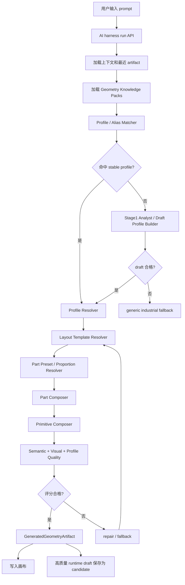

# LLM Primitive 几何生成架构

本文说明项目里 LLM 通过 primitive 工具生成可编辑物品的架构。这里的 primitive 工具不是单指 `compose_primitive`，而是 AI harness 暴露给模型的一组几何生成能力，包括 `compose_recipe`、`compose_assembly`、`compose_parts`、`compose_robot_arm`、`compose_primitive` 和 `revise_geometry`。

当前架构的核心判断是：

> Profile 只描述“设备是什么”，不能单独保证“生成得像”。复杂工业设备需要 Profile + Layout Template + Part Preset + Proportion Rules + Quality Rules 一起工作。

## 目标

1. LLM 负责理解意图、选择路线、给出结构化参数，不直接写最终 scene node。
2. 本地 deterministic executor 负责生成 shape、transform、material、semanticRole 和质量校验。
3. 设备知识尽量资源包化，减少为每个设备硬编码 TS 逻辑。
4. 生成结果必须可编辑、可校验、可修订。
5. 没有稳定 profile 时，先生成 draft profile，再经过 validator，而不是直接自由拼 primitive。

## 总体流程



## 分层定义

### Primitive

最底层的几何原子，例如 box、cylinder、torus、cone、frustum、rounded box、ellipse panel 等。

职责：

- 只表达纯几何和材质。
- 不携带行业知识。
- 不负责判断“这是不是一台设备”。

主要代码：

- `packages/core/src/lib/primitive-registry.ts`
- `packages/core/src/lib/primitive-compose.ts`

### Recipe

确定性机械零件生成器，例如齿轮、法兰、螺栓、轴承座、标准阀件等。

职责：

- 生成标准小部件。
- 可被 Part 或 Layout 复用。
- 不承担完整设备布局。

主要代码：

- `packages/core/src/lib/primitive-recipes.ts`

### Part

跨行业复用的语义零件能力，例如底座、机壳、电机、管口、法兰、控制箱、观察窗、输送带、滚筒、支腿、护罩等。

职责：

- 暴露可编辑属性，例如 length、width、height、radius、color、material、count。
- 保持行业无关。
- 被 profile、layout template、part preset 调用。

主要代码：

- `packages/core/src/lib/part-registry.ts`
- `packages/core/src/lib/part-compose.ts`

### Family / Layout Family

Family 不再表示具体设备百科，而是稳定布局能力。

示例：

- `rotating_machine_layout`
- `vessel_layout`
- `linear_transport_layout`
- `box_enclosure_layout`
- `robot_workcell_layout`
- `pipe_valve_layout`
- `generic_industrial_layout`

职责：

- 提供可复用的空间布局类别。
- 数量应少而稳定。
- 不应该为每个具体设备新增 family。

### Device Profile

Profile 是具体设备知识入口，描述“设备应该有哪些部件、主语义是什么、默认尺寸是什么、该用哪个 layout template”。

推荐结构：

```ts
type DeviceProfile = {
  id: string
  name: string
  aliases: string[]
  industry?: string
  family: string
  layoutFamily?: string
  layoutTemplate?: string
  defaultDimensions?: {
    length?: number
    width?: number
    height?: number
    diameter?: number
  }
  parts: Array<{
    kind: string
    semanticRole: string
    required?: boolean
    preset?: string
    params?: Record<string, unknown>
  }>
  primarySemanticRole: string
  partPresets?: Record<string, string>
  proportionRules?: string | Record<string, unknown>
  qualityRules?: string | Record<string, unknown>
  status: 'runtime_draft' | 'candidate' | 'pending_review' | 'stable' | 'draft'
  source: 'builtin' | 'workspace' | 'imported_pack' | 'generated_candidate'
  sourcePack?: {
    id: string
    version: string
    industry?: string
  }
}
```

Profile 能解决：

- 设备别名匹配。
- 设备由哪些 part 组成。
- 主形体和 required roles。
- 默认尺寸。
- 后续编辑时的 semanticRole 定位。

Profile 不能单独解决：

- 机器臂关节姿态。
- 回转窑长筒体比例。
- 篦冷机篦床层级。
- 反应釜封头、夹套、搅拌轴的空间拓扑。

这些必须交给 Layout Template、Part Preset、Proportion Rules 和 Quality Rules。

### Layout Template

Layout Template 描述部件之间的空间骨架，不写可执行代码。

示例：

```json
{
  "id": "articulated_robot.six_axis",
  "family": "robot_workcell_layout",
  "anchors": [
    { "id": "base", "position": [0, 0, 0] },
    { "id": "shoulder", "relativeTo": "base", "offset": [0, 0.42, 0] },
    { "id": "elbow", "relativeTo": "shoulder", "offsetRule": "upperArmVector" },
    { "id": "wrist", "relativeTo": "elbow", "offsetRule": "forearmVector" }
  ],
  "placements": [
    { "role": "robot_base", "anchor": "base" },
    { "role": "upper_arm", "between": ["shoulder", "elbow"] },
    { "role": "forearm", "between": ["elbow", "wrist"] }
  ]
}
```

职责：

- 定义 anchors、placements、bounds。
- 把“像不像”的核心拓扑从 TS 设备硬编码里移出来。
- 被本地 Layout Resolver 解释。

### Part Preset

Part Preset 描述某类 part 的默认造型和参数映射。

示例：

```json
{
  "id": "robot_joint.large",
  "partKind": "cylinder",
  "defaults": {
    "segments": 48,
    "material": "painted_metal"
  },
  "parameters": {
    "radius": { "from": "reach", "scale": 0.12 },
    "height": { "from": "reach", "scale": 0.16 }
  }
}
```

职责：

- 减少 profile 里重复写几何参数。
- 让同一行业包或多个行业包复用零件风格。
- 给 LLM 和修订逻辑暴露更清楚的可编辑属性。

### Proportion Rules

比例规则描述整体尺寸如何映射到关键部件。

示例：

```json
{
  "reach": { "from": "height", "scale": 0.9 },
  "upperArmLength": { "from": "reach", "scale": 0.43 },
  "forearmLength": { "from": "reach", "scale": 0.48 }
}
```

职责：

- 保证不同尺寸下仍有合理比例。
- 避免某个设备在默认尺寸好看，换尺寸后崩坏。

### Quality Rules

质量规则描述生成后如何判断“像不像”。

示例：

```json
{
  "id": "quality.rotary_kiln",
  "requiredRoles": ["kiln_shell", "support_roller", "gear_ring", "kiln_head", "kiln_tail"],
  "forbiddenRoles": ["wheel", "car_body", "desk_leg"],
  "shapeCount": { "min": 8, "max": 40 },
  "dimensionExpectations": {
    "lengthToDiameterRatio": { "min": 5, "max": 18 }
  }
}
```

职责：

- 检查主形体、required roles、forbidden roles。
- 检查 shapeCount 是否过少或过量。
- 检查关键比例，例如回转窑长径比。
- 低分时触发 repair 或 fallback。

## Geometry Knowledge Pack

为了减少硬编码，资源包从“profile pack”升级为“Geometry Knowledge Pack”。

推荐结构：

```txt
cement-pack.zip
  pack.json
  profiles/
    rotary-kiln.json
    grate-cooler.json
  layouts/
    rotary-drum-layout.json
    grate-bed-layout.json
  part-presets/
    kiln-shell.json
    support-roller.json
  quality-rules/
    rotary-kiln-quality.json
  aliases/
    zh-CN.json
```

`pack.json` 示例：

```json
{
  "id": "industry.cement.basic",
  "name": "Cement Basic Equipment Pack",
  "industry": "cement",
  "version": "0.1.0",
  "schemaVersion": "1.1",
  "knowledgeSchemaVersion": "1.0",
  "profiles": ["profiles/rotary-kiln.json"],
  "layouts": ["layouts/rotary-drum-layout.json"],
  "partPresets": ["part-presets/kiln-shell.json"],
  "qualityRules": ["quality-rules/rotary-kiln-quality.json"],
  "aliases": ["aliases/zh-CN.json"]
}
```

资源包规则：

- 只允许 JSON/YAML 数据，不允许 JS/TS 可执行代码。
- 文件路径必须是相对路径，不能逃出包目录。
- 同名 profile 优先级：`workspace > imported_pack > builtin > generated_candidate`。
- imported profile 会记录 `sourcePack.id`、`sourcePack.version` 和 `industry`。
- 资源包可以安装、禁用、删除；启用后自动参与 profile 匹配，不要求用户每次选择行业。

## Builtin 与资源包冲突

项目里会保留少量 builtin profile 和 deterministic fallback，用来保证没有资源包时也能生成基本设备。资源包导入后，冲突处理遵循：

```txt
workspace > imported_pack > builtin > generated_candidate
```

这意味着：

- 如果资源包和 builtin 有同 id profile，资源包 profile 会覆盖 builtin profile。
- 覆盖只发生在数据层：profile、layoutTemplate、partPresets、proportionRules、qualityRules。
- 资源包不能替换底层 TS composer，例如 `compose_robot_arm`、`part-compose.ts`、`primitive-compose.ts`。
- 合并后的 profile 会记录 `overrides`，run 结果会显示 `overrodeBuiltin: true`。
- 如果资源包 profile 校验失败，它不会进入可用 profile 列表，builtin fallback 仍然可用。

示例：

```json
{
  "selectedProfile": "robot.six_axis_arm",
  "profileSource": "imported_pack",
  "profilePackId": "industry.robotics.basic",
  "overrodeBuiltin": true,
  "layoutTemplate": "articulated_robot.six_axis"
}
```

机器臂的推荐拆法：

- builtin 保留：robot arm composer 能力、基础 robot parts、最小 fallback profile。
- robotics 资源包提供：FANUC-like、KUKA-like、ABB-like、SCARA、palletizer、welding cell 等 profile/layout/preset/quality 数据。

当前主要代码：

- `apps/editor/lib/profile-packs.ts`
- `apps/editor/lib/device-profiles.ts`
- `apps/editor/app/profile-packs/page.tsx`

## Run 路由策略

### 1. Revision 优先

如果用户说“改成蓝色”“再大一点”“轮子变大”，并且上下文里有上一次 artifact，优先走 `revise_geometry`。

### 2. Stable Profile 优先

如果 prompt 命中 stable profile：

1. 读取 profile source、sourcePack、layoutTemplate、partPresets、qualityRules。
2. 构造 `compose_parts` 参数。
3. 本地 deterministic 执行。
4. 记录 route metrics 和 profile quality。

### 3. Draft Profile

如果没有 stable profile，但像工业设备：

1. Stage1 先尝试输出 `deviceProfileDraft`。
2. 本地 `buildDraftDeviceProfile()` 兜底。
3. draft 必须通过 schema validator、registry validator、execution smoke validator。
4. 生成质量足够高时保存为 candidate。

### 4. Generic Fallback

如果 draft 失败：

- 走 `generic_industrial_layout`。
- 不能空白。
- 质量低则 repair 或提示失败原因。

### 5. Compose Primitive 兜底

`compose_primitive` 适合简单几何体，例如“10m x 10m 长方体”“1m x 2m 蓝色玻璃”。完整工业设备不应默认走这条路线。

## 常见问题判断

### 机器臂为什么只靠 profile 不够？

机器臂的关键不是“有哪些零件”，而是“关节链怎么摆”。Profile 可以说有 base、shoulder、upper_arm、elbow、forearm、wrist、flange，但如果没有 `articulated_robot.six_axis` 这种 layout template，primitive 很容易拼得像杂乱积木。

### 回转窑为什么需要 quality rules？

回转窑必须是长筒体，并带托轮、齿圈、窑头、窑尾。只写 parts 不能保证长径比合理，所以要在包里配置 `lengthToDiameterRatio` 规则。

### 什么时候新增 TS 代码？

按优先级：

1. 只缺设备知识：新增或修改资源包 profile。
2. 需要特殊空间骨架：新增 layout template 数据。
3. 需要复用零件造型：新增 part preset 数据。
4. 需要评价标准：新增 quality rules 数据。
5. Part 能力确实缺失：改 `part-registry` / `part-compose`。
6. Primitive 几何能力缺失：改 `primitive-registry` / `primitive-compose`。
7. 最后才改 prompt。

## 当前开发方向

短期目标：

1. Profile schema 支持 `layoutTemplate`、`partPresets`、`proportionRules`、`qualityRules`、`sourcePack`。
2. Pack manifest 支持 `layouts`、`partPresets`、`qualityRules`、`aliases`。
3. Loader 校验这些资源文件，并把 pack metadata 注入 imported profile。
4. Run 结果记录 profile source、pack id、layout template 和质量规则。
5. 先迁移六轴机器臂、回转窑、篦冷机作为样板。

中期目标：

1. 实现通用 Layout Template Resolver。
2. 实现 Part Preset Resolver。
3. 让 Quality Evaluator 消费包内 quality rules。
4. 把水泥行业包做成完整样板。

长期目标：

1. 行业包可在云端分发。
2. 用户按需安装水泥、化工、食品、造纸等行业包。
3. 高质量 generated candidate 可人工审核后晋升为 workspace profile 或行业包 profile。

## Profile Editability And Detail Budget Contract

For profile-driven primitive generation, each production-grade profile should define three
contracts:

1. `editableSchemaRef` / `editableOverrides`: declares what natural language edits may change.
2. `detailBudget`: declares the default detail level and per-part count limits before execution.
3. `qualityRules`: declares how the generated result is scored after execution.

`detailBudget` is data, not code. It can live in builtin profiles, workspace profiles, or imported
profile packs:

```json
{
  "editableSchemaRef": "conveyor.common",
  "detailBudget": {
    "detailLevel": "low",
    "maxShapes": 52,
    "parts": {
      "cooling_air_box": { "count": 5, "detailLevel": "low" },
      "cooler_grate_bed": { "detailLevel": "low" }
    }
  },
  "qualityRules": {
    "requiredRoles": ["cooler_housing", "cooler_grate_bed", "cooling_air_box"],
    "shapeCount": { "min": 8, "max": 52 }
  }
}
```

Part budget keys are matched by part `id`, `semanticRole`, or `kind`. Supported budget controls
include `detailLevel`, `count`, `ringCount`, `spokeCount`, `slatCount`, `rungCount`, `boltCount`,
`radialSegments`, and `levelCount`.

## Internal Part Layout Contract

Profile parts should prefer semantic layout hints over handwritten coordinates. The local layout
resolver consumes these fields before `compose_parts` executes:

- `attachToRole`: attach this part to a previously placed part by `semanticRole` or `kind`.
- `anchor`: one of `top`, `bottom`, `front`, `back`, `left`, `right`, `shell_center`,
  `drive_side`, or `service_side`.
- `side`: fallback placement side when `anchor` is omitted.
- `offset`: optional `[x, y, z]` local correction after anchor placement.
- `arrayAlong`: distribute repeated parts along `length`/`x`, `width`/`z`, or `height`/`y`.

Example:

```json
{
  "parts": [
    { "kind": "cylindrical_tank", "semanticRole": "vessel_shell", "required": true },
    {
      "kind": "flanged_nozzle",
      "semanticRole": "feed_nozzle",
      "attachToRole": "vessel_shell",
      "anchor": "top",
      "offset": [0.18, 0, 0]
    },
    {
      "kind": "platform_ladder",
      "semanticRole": "access_platform",
      "attachToRole": "vessel_shell",
      "anchor": "service_side"
    },
    {
      "kind": "bearing_block",
      "semanticRole": "support_roller",
      "attachToRole": "vessel_shell",
      "anchor": "bottom",
      "arrayAlong": "length",
      "count": 2
    }
  ]
}
```

The first supported layout families are `vessel_layout`, `rotating_machine_layout`,
`box_enclosure_layout`, and `linear_transport_layout`. This keeps reactor nozzles/platforms,
rotary kiln riding rings/support rollers/drive units, enclosure controls/vents, and conveyor drive
parts stable without adding device-specific TypeScript code.
