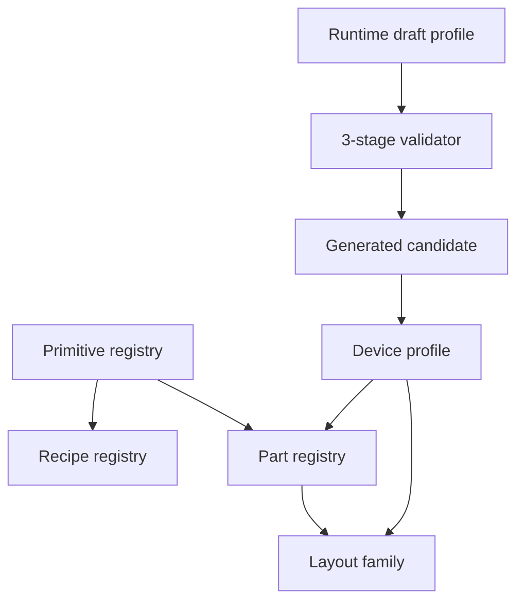

# Device Profile Architecture

AI geometry uses four layers:



## Responsibilities

- **Primitive**: geometry-only shapes and parameters.
- **Recipe**: deterministic closed-form parts such as gears, flanges, bolts, and elbows.
- **Part**: reusable semantic industrial components with LLM-safe parameters.
- **Layout family**: stable spatial layout capability, such as `rotating_machine_layout`, `vessel_layout`, `linear_transport_layout`, and `box_enclosure_layout`.
- **Device profile**: concrete equipment knowledge. Profiles map device names and aliases to a layout family, executable family, primary semantic role, dimensions, and parts.

Family ids should stay small and stable. New industrial devices should normally be added as profile data, not as new family code.

## Profile Sources

Profiles are merged by predictable priority:

```txt
workspace > imported_pack > builtin > generated_candidate
```

Source locations:

```txt
apps/editor/data/device-profiles/*.json|yaml
apps/editor/data/device-profile-packs/**/*.json|yaml
apps/editor/.generated/device-profile-candidates/**/*.json|yaml
```

Generated candidates are intentionally lowest priority and cannot override workspace or builtin profiles.

## Lifecycle

```txt
runtime_draft -> candidate -> pending_review -> stable
```

- `runtime_draft`: produced during a run when no stable profile matches.
- `candidate`: saved after successful execution and profile-aware quality scoring.
- `pending_review`: reserved for human review workflows.
- `stable`: trusted profile data, either builtin or workspace.

Candidates are saved under:

```txt
apps/editor/.generated/device-profile-candidates/
```

They record the original prompt, draft profile, family, primary semantic role, generated roles, shape count, quality score, and creation time.

## Validation

Draft and candidate profiles pass three gates:

- **Schema**: required fields and field types.
- **Registry**: executable family exists, part kinds exist, primary semantic role is represented.
- **Execution smoke**: `compose_parts` can execute, shape count is bounded, bounding dimensions are plausible, and required roles are covered.

## Quality

Profile-aware quality produces:

```ts
{
  semanticScore,
  geometryScore,
  editabilityScore,
  visualCompletenessScore,
  overallScore
}
```

Low scores trigger repair/fallback. High-quality runtime drafts can become generated candidates, but they are never promoted to `stable` automatically.

## Subpart Selection And Editing

Factory editing should support three selection scopes:

```txt
factory/process scope -> equipment assembly scope -> subpart/shape scope
```

The default user experience is:

- If nothing is selected, natural-language edits operate on the factory or the latest generated object.
- If an assembly is selected, edits operate on that equipment assembly and can expand to its editable child nodes.
- If a generated subpart or shape is selected, edits operate only on that selected semantic part unless the user asks for all matching parts.

Example:

```txt
Select one fan blade -> "make this blade longer"
Select fan assembly -> "make all blades longer"
Select water treatment plant -> "add another filter vessel"
```

Generated primitive shapes already carry the metadata needed for subpart targeting:

```ts
type PrimitiveShapeSelector = {
  index?: number
  occurrence?: number
  semanticRole?: string
  semanticGroup?: string
  sourcePartKind?: string
  sourcePartId?: string
  kind?: string
  nameIncludes?: string
}
```

The renderer and selection context should preserve this metadata when converting generated artifacts into scene nodes. A selected subpart should be represented as a stable edit target:

```ts
type SelectedGeneratedSubpart = {
  assemblyId: string
  nodeId: string
  shapeIndex?: number
  selector: PrimitiveShapeSelector
  label?: string
  editableHints?: {
    canScale?: string[]
    primaryDimension?: string
    minFactor?: number
    maxFactor?: number
  }
}
```

Natural-language revision should prefer the selected subpart selector over broad role matching. This prevents requests such as "make it larger" from modifying every `fan_blade` when the user intentionally selected one blade.

Subpart edits are divided into two paths:

- **Instance edit**: modifies only the selected scene node or generated shape. Use this for one-off changes such as color, length, offset, rotation, or material.
- **Profile/preset edit**: modifies the source profile, part preset, or layout data. Use this only when the user explicitly asks for future generated equipment of the same type to inherit the change.

The first implementation target should cover:

- select a child shape inside a generated assembly,
- show its semantic label in the UI,
- pass `SelectedGeneratedSubpart` into the AI harness run context,
- route color, material, scale, resize, rotate, move, remove, and replace requests through `revise_geometry`,
- keep assembly-level edits working as the fallback.

## Migration Rule

Legacy executable ids remain supported as aliases and execution capabilities:

```txt
pump       -> rotating_machine_layout + centrifugal_pump profile
compressor -> rotating_machine_layout + screw_compressor/default profile
tank       -> vessel_layout + vertical_storage_tank profile
```

When adding equipment, first decide whether an existing layout family can place it. If yes, add a profile JSON. Add a new family only when the system needs a genuinely new reusable layout/execution capability.
