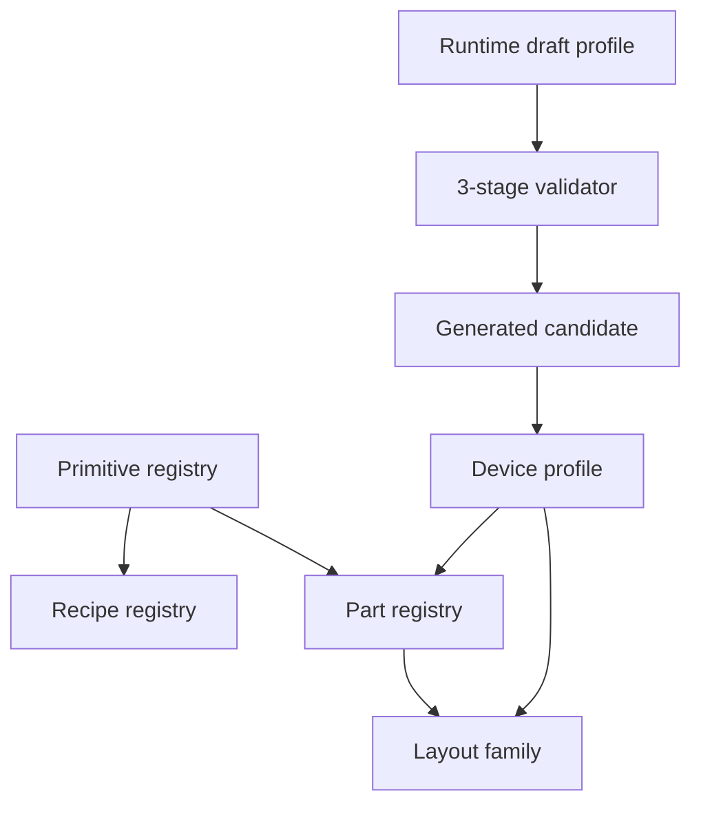

# Device Profile Architecture

AI geometry uses four layers:



## Responsibilities

- **Primitive**: geometry-only shapes and parameters.
- **Recipe**: deterministic closed-form parts such as gears, flanges, bolts, and elbows.
- **Part**: reusable semantic industrial components with LLM-safe parameters.
- **Layout family**: stable spatial layout capability, such as `rotating_machine_layout`, `vessel_layout`, `linear_transport_layout`, and `box_enclosure_layout`.
- **Device profile**: concrete equipment knowledge. Profiles map device names and aliases to a layout family, executable family, primary semantic role, dimensions, and parts.

Family ids should stay small and stable. New industrial devices should normally be added as profile data, not as new family code.

## Profile Sources

Profiles are merged by predictable priority:

```txt
workspace > imported_pack > builtin > generated_candidate
```

Source locations:

```txt
apps/editor/data/device-profiles/*.json|yaml
apps/editor/data/device-profile-packs/**/*.json|yaml
apps/editor/.generated/device-profile-candidates/**/*.json|yaml
```

Generated candidates are intentionally lowest priority and cannot override workspace or builtin profiles.

## Lifecycle

```txt
runtime_draft -> candidate -> pending_review -> stable
```

- `runtime_draft`: produced during a run when no stable profile matches.
- `candidate`: saved after successful execution and profile-aware quality scoring.
- `pending_review`: reserved for human review workflows.
- `stable`: trusted profile data, either builtin or workspace.

Candidates are saved under:

```txt
apps/editor/.generated/device-profile-candidates/
```

They record the original prompt, draft profile, family, primary semantic role, generated roles, shape count, quality score, and creation time.

## Validation

Draft and candidate profiles pass three gates:

- **Schema**: required fields and field types.
- **Registry**: executable family exists, part kinds exist, primary semantic role is represented.
- **Execution smoke**: `compose_parts` can execute, shape count is bounded, bounding dimensions are plausible, and required roles are covered.

## Quality

Profile-aware quality produces:

```ts
{
  semanticScore,
  geometryScore,
  editabilityScore,
  visualCompletenessScore,
  overallScore
}
```

Low scores trigger repair/fallback. High-quality runtime drafts can become generated candidates, but they are never promoted to `stable` automatically.

## Migration Rule

Legacy executable ids remain supported as aliases and execution capabilities:

```txt
pump       -> rotating_machine_layout + centrifugal_pump profile
compressor -> rotating_machine_layout + screw_compressor/default profile
tank       -> vessel_layout + vertical_storage_tank profile
```

When adding equipment, first decide whether an existing layout family can place it. If yes, add a profile JSON. Add a new family only when the system needs a genuinely new reusable layout/execution capability.
