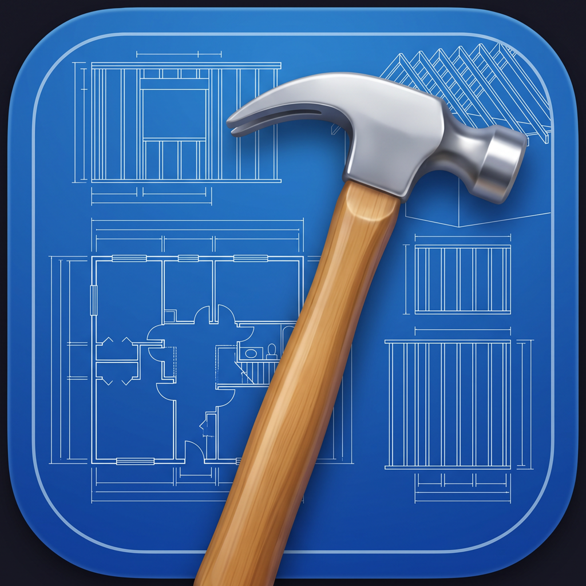
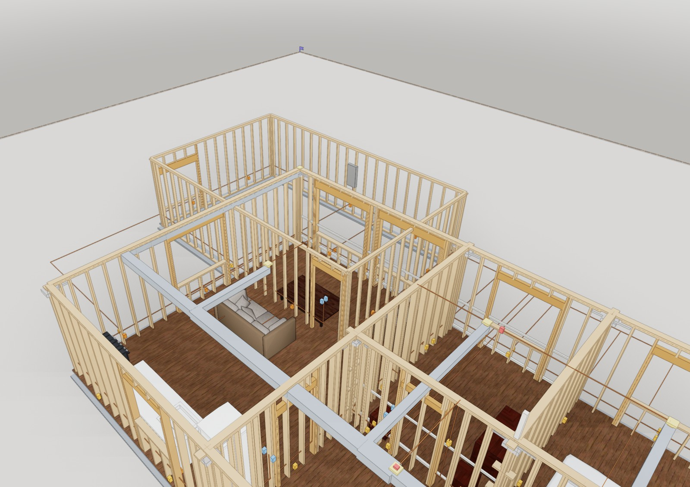

<p align="center">
  
</p>

<h1 align="center">Bones</h1>

<p align="center"><strong>The engineering X-ray for <a href="https://github.com/pascalorg/editor">Pascal</a>.</strong><br/>
See through the finishes to what actually gets built — framing, foundation, wiring,
plumbing, ductwork — derived from your model, sized to your jurisdiction, rendered in 3D.</p>

---

<p align="center">
  
</p>

## What it does

Draw a house in Pascal. Click **⚡ X-Ray this level**. Bones derives the
construction inside it:

- **Wall framing** — studs at 16"/24" o.c., bottom/top/cap plates, and around every
  door and window: king studs, trimmers, headers auto-sized by span, sills, cripples.
- **CMU walls** — Florida-style exterior block: running-bond coursing, precast
  lintels, bond beams. Per-wall override: framed / CMU / skip.
- **Floor framing** — joists sized by span tables, rim joists, girders + posts when
  the tables run out, blocking.
- **Roof framing** — rafters, ridge, hips, ceiling joists, collar ties; hurricane
  ties in high-wind states.
- **Foundation** — frost-depth footings, stemwalls, anchor bolts at code spacing,
  seismic hold-downs where the SDC calls for them.
- **Electrical** — NEC 210.52 receptacle walks (doorways break the wall line), GFCI
  in wet rooms, switches at latch sides, lights, smoke alarms, the panel.
- **Plumbing & HVAC** — schematic DWV stack + drains + supplies to wet walls;
  equipment, trunk + branch ducts, registers, return, thermostat.
- **Takeoff** — counted from the actual generated members (never re-estimated):
  lumber by size and stock length, board feet, concrete yards, block counts,
  devices. Copy as CSV.

Everything is **derived, live**: move a wall and the skeleton re-frames instantly.
Only a small per-level config node is saved with the project.

### Jurisdictions

Building codes are adopted per **state** (researched dataset: all 50 + DC —
adopted code editions, frost lines, snow/wind/seismic values, with sources in
[docs/research/](docs/research/)). Pick your state — or let **Auto** suggest one
from your browser's timezone (zero network calls) — and LOD *Code-sized* applies
it: footing depths chase your frost line, anchor bolts tighten in seismic states,
hurricane ties appear on the coast, Florida walls turn to block. Outside the US,
the **International (generic)** profile applies conservative defaults.

> **Drafting aid, not engineering.** Values are typical/approximate — always
> verify with your local building department.

## Using it

Bones ships in the Pascal editor's Plugins sidebar (installed by default when the
host bundles it). Open the **Bones** rail panel → *X-Ray this level*. Toggle
systems, switch jurisdiction, select a wall to override its construction, copy
the takeoff. *Loose lumber* at the bottom places individual members (2x4 … 6x6 at
actual dressed sizes) for hand-framing and debugging.

## Publisher

- **Author:** Julien Brissonneau — [@Snoopy147](https://github.com/Snoopy147)
- **Org:** [pascalorg](https://github.com/pascalorg) · **Support:** [issues](https://github.com/pascalorg/plugin-bones/issues) · **License:** MIT

## Capabilities & data

- Node kinds: `bones:framing` (per-level X-ray config), `bones:lumber` (loose
  members). One editor panel ("Bones").
- **No external origins, no network calls, no accounts, no personal data.** The
  jurisdiction auto-suggestion reads the browser's timezone/locale locally.
- Persisted project data: only the plugin's own config/lumber nodes. All derived
  members live in memory.
- Lazy renderer/panel entry points; peer-deps on `@pascal-app/*`, React, Three.js.

## Develop

```bash
bun install
bun run check-types
bun test            # engine geometry tests, NEC walks, table lookups
```

Architecture and geometry conventions: [ARCHITECTURE.md](ARCHITECTURE.md).
Roadmap and LOD ladder: [SPEC.md](SPEC.md). Domain research with sources:
[docs/research/](docs/research/).

## Load in a host

```ts
import { extendPluginDiscovery } from '@pascal-app/core'
import { registerEditorHostPanel } from '@pascal-app/editor'

extendPluginDiscovery(async () => {
  const { bonesPlugin } = await import('@pascal-app/plugin-bones')
  return [bonesPlugin]
})
const { bonesHostPanel } = await import('@pascal-app/plugin-bones')
registerEditorHostPanel(bonesHostPanel)
```
