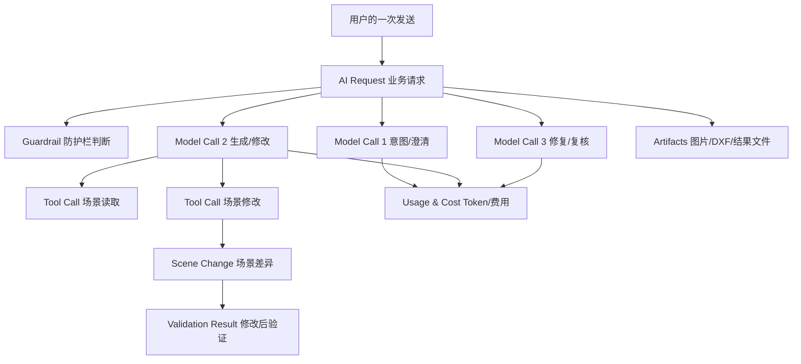
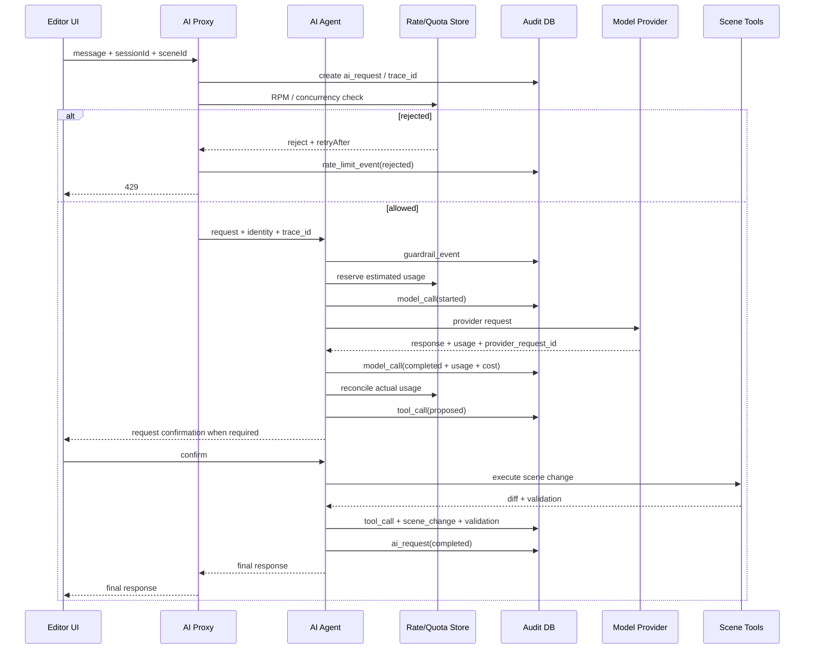

# AI 使用计量、内容留存、审计与限流设计

状态：设计草案（2026-07-15）

## 1. 背景与目标

户型 AI 不是一次简单的“用户问题 → 模型回答”。一次用户操作可能经历意图识别、范围防护、需求澄清、户型生成、工具调用、场景修改、结果验证、自动修复和重试，多轮模型调用共同完成一个业务请求。

如果只记录最终回复或总 Token，会缺失以下关键事实：

- 哪个用户、项目和场景发起了请求；
- 请求是否属于建筑/户型设计范围，是否被防护栏拦截；
- 一次用户请求实际调用了几次模型、用了哪些模型；
- 每次调用分别消耗多少输入、输出和缓存 Token；
- AI 调用了哪些工具、修改了哪些建筑节点；
- 用户是否确认了修改，修改前后对应哪个场景版本；
- 失败发生在模型、工具、校验、保存还是并发冲突阶段；
- 费用、额度、限流和供应商账单能否互相核对；
- 用户删除会话后，哪些内容必须删除，哪些财务/审计元数据可以继续保留。

本设计目标：

1. 对每一次真实模型调用进行准确计量和费用归集；
2. 支持按用户、组织、项目、功能、模型和日期统计用量；
3. 支持请求频率、并发数、Token 和费用多维限流；
4. 为 AI 修改建筑场景提供可追溯、可回滚的操作审计；
5. 在满足会话恢复和问题排查的同时，控制问题、回复、图片等敏感内容的留存范围；
6. 避免 Prompt、API Key、户型图片和用户隐私进入普通日志；
7. 支持后续计费、积分、套餐、运营分析和质量评估。

非目标：

- 不记录或推导模型隐藏思维链；
- 不把完整模型请求、图片 Base64 和系统提示写入普通应用日志；
- 不用进程内计数器承担生产环境的最终额度结算；
- 不以“用户点击一次发送”代替真实模型调用次数。

## 2. 核心结论

### 2.1 问题和回答要不要保存

建议保存，但分层处理：

- **用户实际发送的问题**：保存，用于多轮会话、历史恢复、防护栏误判复核和用户支持；内容需要加密、可删除、设置留存期限。
- **最终展示给用户的回答**：保存，这是会话产品数据，应以用户实际看到的版本为准。
- **模型原始输出**：默认不长期保存；仅对失败请求、用户反馈请求和少量质量采样短期保存。
- **完整供应商请求载荷**：默认不保存；保存 Prompt 版本、模板哈希、参数和内容长度即可。
- **系统提示**：只保存 `prompt_version` 和 `prompt_hash`，不在每条记录中重复保存全文。
- **隐藏推理过程**：不保存。只保存最终结论、结构化计划、工具参数和验证结果。
- **户型图、DXF 和其他附件**：文件放私有对象存储，数据库只存引用和元数据，不存 Base64。

### 2.2 对建筑 AI 而言，什么比聊天文字更重要

比“AI 回答了什么”更重要的是：

- AI 计划做什么；
- AI 实际调用了什么工具；
- 用户是否确认；
- 修改了哪些节点和字段；
- 修改前后场景版本是什么；
- 修改后是否通过 Schema、引用、几何、碰撞和业务规则验证；
- 是否自动修复、回滚或留下问题。

因此需要把会话、模型调用、工具调用和场景变更拆开记录，不能全部塞进一张聊天记录表。

## 3. 请求层级和关联关系

推荐的数据层级：



关键约束：

- 一个 `ai_request` 对应一次用户业务动作；
- 一个 `ai_request` 可以对应多条 `ai_model_calls`；
- 每次模型重试都要单独记录，不能覆盖上一条；
- 一个模型调用可以产生多个 `ai_tool_calls`；
- 一个写工具调用可以产生一条或多条 `ai_scene_changes`；
- 被防护栏直接拦截的请求也要有 `ai_request` 和 `ai_guardrail_event`，其模型用量可以为 0；
- 如果防护栏本身调用小模型，该调用也必须记入 `ai_model_calls`。

## 4. 当前链路需要补齐的能力

从编辑器边界能确认的现状：

1. AI 助手的 `/api/ai/*` 是代理转发，代理本身不提取 Token、不落使用记录，也没有接入场景 API 的限流保护；
2. Anthropic 视觉分析能拿到 `message.usage`，当前只读取 `message.content`，Token 数据未进入返回值或持久层；
3. 视觉分析存在图片大小、超时和 `max_tokens` 限制，但这些不是按用户/组织的请求额度；
4. 场景 API 的每分钟限流是进程内 IP 计数，不能直接视为生产级 AI 限流；
5. AI 助手前端支持恢复会话消息，说明会话内容属于产品数据，但需要进一步统一内容删除、留存和权限规则；
6. 需要在 AI Agent 内部逐个模型调用点复核：供应商、模型、重试、工具调用和会话持久化是否都有统一入口，避免只在 HTTP 代理层统计。

最终实现应以 AI Agent 的真实供应商调用层为计量真相源，编辑器代理只负责身份传递、请求关联和入口限流。

## 5. 数据模型

推荐使用关系数据库保存元数据和审计记录，图片、DXF、截图和大型原始响应放对象存储。以下字段为逻辑模型，可按现有数据库框架调整类型和命名。

### 5.1 `ai_requests`：一次用户业务请求

一条记录代表用户点击一次发送、确认生成、确认修改、取消任务或系统发起一次自动修复。

| 字段 | 说明 |
|---|---|
| `id` | UUID，业务请求主键 |
| `trace_id` | 跨编辑器、代理、Agent、模型和工具的全链路 ID |
| `idempotency_key` | 防止客户端重试造成重复生成或重复扣费 |
| `session_id` | AI 会话 ID |
| `parent_request_id` | 自动修复、继续生成等子请求的父请求 |
| `user_id` | 用户 ID；未登录场景使用匿名主体 ID |
| `organization_id` | 团队/企业归属 |
| `project_id` | 项目 ID |
| `scene_id` | 场景 ID |
| `scene_version_at_start` | 请求开始时的场景版本 |
| `job_id` | DXF、视觉分析或异步生成任务 ID |
| `feature` | `floorplan_chat`、`generate`、`modify`、`vision`、`repair` 等 |
| `action` | `message`、`confirm`、`cancel`、`retry` 等 |
| `intent` | 结构化意图，例如 `scene_modification`、`scene_question` |
| `scope` | `in_scope`、`out_of_scope`、`unclear`、`unsafe` |
| `status` | `queued`、`running`、`completed`、`failed`、`blocked`、`cancelled` |
| `prompt_version` | 主业务 Prompt 版本 |
| `policy_version` | 防护栏/权限策略版本 |
| `model_call_count` | 实际模型调用总数 |
| `tool_call_count` | 实际工具调用总数 |
| `retry_count` | 供应商或业务重试次数 |
| `input_chars` | 用户文字字符数，用于非内容型分析 |
| `attachment_count` | 附件数量 |
| `started_at` | 请求开始时间 |
| `completed_at` | 请求结束时间 |
| `latency_ms` | 端到端耗时 |
| `error_stage` | `guardrail`、`model`、`tool`、`validation`、`save` 等 |
| `error_code` | 稳定的机器可读错误码 |
| `error_message_safe` | 已脱敏的错误摘要 |
| `created_at` | 创建时间 |

不要在此表直接放完整问题和回复；消息使用独立表，便于单独加密、删除和设置留存时间。

### 5.2 `ai_messages`：会话问题和最终回答

| 字段 | 说明 |
|---|---|
| `id` | 消息 ID |
| `session_id` | 所属会话 |
| `request_id` | 产生或消费该消息的业务请求 |
| `sequence_no` | 会话内稳定顺序 |
| `role` | `user`、`assistant`、`tool`、`system_summary` |
| `content_type` | `text`、`structured`、`artifact_reference` |
| `content_encrypted` | 加密后的原文，可为空 |
| `content_redacted` | 可选脱敏文本，供受限搜索和客服查看 |
| `content_hash` | 去重/重复请求检测，不用于展示 |
| `char_count` | 字符数 |
| `language` | 语言 |
| `is_user_visible` | 是否实际展示给用户 |
| `is_raw_provider_output` | 是否为供应商原始输出 |
| `retention_class` | `session`、`short_debug`、`audit` |
| `retention_until` | 自动清理时间 |
| `deleted_at` | 用户删除或系统清理时间 |
| `created_at` | 创建时间 |

消息保存规则：

- 用户问题和最终助手回复：`retention_class=session`；
- 失败时的模型原始回复：`retention_class=short_debug`；
- 工具返回的大型 JSON 不直接作为消息保存，改存摘要和对象存储引用；
- 会话被用户删除时，优先物理删除或密钥销毁 `content_encrypted`，财务元数据保留但与内容解耦；
- `system` 全量 Prompt 不作为普通消息逐次落库。

### 5.3 `ai_model_calls`：每一次真实供应商调用

这是 Token 和成本的真相表。一条记录对应一次供应商 API 调用，包括失败和重试。

| 字段 | 说明 |
|---|---|
| `id` | 模型调用 ID |
| `request_id` | 所属业务请求 |
| `attempt_no` | 第几次尝试 |
| `operation` | `guardrail`、`clarify`、`plan`、`generate`、`repair`、`vision` |
| `provider` | `anthropic`、`openai` 等 |
| `provider_request_id` | 供应商返回的请求 ID，用于账单核对 |
| `model` | 实际模型名称，不只记录配置别名 |
| `prompt_version` | Prompt 版本 |
| `prompt_hash` | 实际系统 Prompt 的不可逆哈希 |
| `request_params` | 非敏感参数：`max_tokens`、temperature、tool choice 等 |
| `input_tokens` | 输入 Token |
| `output_tokens` | 输出 Token |
| `reasoning_tokens` | 供应商明确返回时记录，不自行推测 |
| `cache_creation_tokens` | Prompt cache 写入 Token |
| `cache_read_tokens` | Prompt cache 命中 Token |
| `total_tokens` | 统一口径总量 |
| `input_unit_price` | 调用发生时输入单价 |
| `output_unit_price` | 调用发生时输出单价 |
| `cache_write_unit_price` | 缓存写入单价 |
| `cache_read_unit_price` | 缓存读取单价 |
| `estimated_cost` | 本次调用估算成本 |
| `currency` | 例如 `USD` |
| `price_version` | 价格表版本，避免以后重算历史成本失真 |
| `status` | `started`、`completed`、`failed`、`cancelled` |
| `finish_reason` | 模型停止原因 |
| `http_status` | 供应商 HTTP 状态 |
| `provider_error_code` | 供应商错误码 |
| `latency_ms` | 总耗时 |
| `time_to_first_token_ms` | 流式接口可记录首 Token 耗时 |
| `started_at` | 开始时间 |
| `completed_at` | 完成时间 |

注意事项：

- 失败请求也可能产生费用，不能只记录成功请求；
- 供应商重试必须创建新记录，不能覆盖第一次调用；
- `provider_request_id` 建唯一或条件唯一索引，防止重复结算；
- 供应商没有返回 `total_tokens` 时，由统一适配层根据明确字段计算；
- Token 字段允许为 `null`，表示供应商未返回；不要用 0 混淆“确实为零”和“未知”；
- 费用使用定点小数或最小货币单位，不能用浮点数累计。

### 5.4 `ai_tool_calls`：模型工具调用

| 字段 | 说明 |
|---|---|
| `id` | 工具调用 ID |
| `request_id` | 业务请求 ID |
| `model_call_id` | 发起该工具调用的模型调用 |
| `provider_tool_call_id` | 供应商工具调用 ID |
| `sequence_no` | 请求内执行顺序 |
| `tool_name` | 工具名称 |
| `tool_category` | `read`、`validate`、`mutate`、`external` |
| `arguments_encrypted` | 加密参数，仅必要时保存 |
| `arguments_redacted` | 脱敏参数或摘要 |
| `arguments_hash` | 幂等和重复调用分析 |
| `requires_confirmation` | 是否需要用户确认 |
| `confirmation_id` | 对应确认记录 |
| `permission_decision` | `allowed`、`denied`、`not_required` |
| `status` | `proposed`、`running`、`completed`、`failed`、`cancelled` |
| `affected_node_ids` | 受影响节点 ID 列表；大型列表可拆表或存对象 |
| `result_summary` | 脱敏、限长结果摘要 |
| `result_artifact_id` | 大型结果文件引用 |
| `error_code` | 工具错误码 |
| `latency_ms` | 工具耗时 |
| `started_at` | 开始时间 |
| `completed_at` | 完成时间 |

读工具也要记录，但可减少内容；写工具必须完整记录确认、影响节点和结果。

### 5.5 `ai_scene_changes`：建筑场景修改审计

这是建筑 AI 最关键的审计表。

| 字段 | 说明 |
|---|---|
| `id` | 场景变更 ID |
| `request_id` | 业务请求 ID |
| `tool_call_id` | 产生修改的工具调用 |
| `scene_id` | 场景 ID |
| `before_version` | 修改前版本 |
| `after_version` | 修改后版本 |
| `operation_count` | 操作数量 |
| `created_node_ids` | 创建节点 ID |
| `updated_node_ids` | 修改节点 ID |
| `deleted_node_ids` | 删除节点 ID |
| `diff_json` | 结构化字段差异，必要时存对象存储 |
| `user_confirmed` | 用户是否确认 |
| `validation_status` | `passed`、`passed_with_warnings`、`failed` |
| `validation_summary` | 验证摘要 |
| `repair_rounds` | 自动修复轮数 |
| `rolled_back` | 是否回滚 |
| `rollback_reason` | 回滚原因 |
| `created_at` | 创建时间 |

建议的差异格式：

```json
{
  "beforeVersion": 18,
  "afterVersion": 19,
  "operations": [
    {
      "type": "update",
      "nodeId": "wall_123",
      "nodeType": "wall",
      "fields": {
        "start": {
          "before": [0, 0],
          "after": [0.5, 0]
        }
      }
    },
    {
      "type": "create",
      "nodeId": "window_789",
      "nodeType": "window",
      "parentId": "wall_123"
    }
  ]
}
```

差异中不要保存运行时 Three.js 对象、临时预览节点或不可序列化字段。

### 5.6 `ai_guardrail_events`：范围与安全防护决策

“今天天气怎么样”这类非建筑问题，即使没有调用主模型，也应该记录防护栏事件。

| 字段 | 说明 |
|---|---|
| `id` | 事件 ID |
| `request_id` | 业务请求 ID |
| `classifier_type` | `rule`、`local_model`、`provider_model` |
| `classifier_model_call_id` | 使用模型分类时关联模型调用 |
| `category` | `in_scope`、`out_of_scope`、`unsafe`、`unclear` |
| `reason_code` | 稳定原因码，例如 `not_architecture_related` |
| `confidence` | 分类置信度 |
| `decision` | `allowed`、`clarify`、`blocked` |
| `policy_version` | 策略版本 |
| `user_override` | 用户是否申诉或重新表述 |
| `created_at` | 创建时间 |

问题原文由 `ai_messages` 管理，防护栏表只存结构化分类，避免重复敏感内容。

### 5.7 `ai_artifacts`：图片、DXF 和大型结果

| 字段 | 说明 |
|---|---|
| `id` | 文件记录 ID |
| `request_id` | 所属业务请求 |
| `session_id` | 所属会话 |
| `kind` | `floorplan_image`、`dxf`、`semantic_json`、`raw_debug` 等 |
| `storage_key` | 私有对象存储 Key，不保存永久公开 URL |
| `mime_type` | MIME 类型 |
| `size_bytes` | 文件大小 |
| `width` / `height` | 图片尺寸 |
| `sha256` | 完整性、去重和审计 |
| `encryption_key_id` | 使用的加密密钥标识 |
| `retention_class` | 留存级别 |
| `retention_until` | 自动删除时间 |
| `deleted_at` | 删除时间 |
| `created_at` | 创建时间 |

禁止把图片 Base64、完整 DXF 或供应商原始响应塞进普通 JSON 日志和数据库文本字段。

### 5.8 `ai_validation_results`：修改后验证

| 字段 | 说明 |
|---|---|
| `id` | 验证记录 ID |
| `request_id` | 业务请求 ID |
| `scene_change_id` | 场景变更 ID |
| `scene_version` | 被验证版本 |
| `validation_type` | `schema`、`references`、`geometry`、`collision`、`layout_rules` |
| `status` | `passed`、`warning`、`failed` |
| `issue_count` | 问题数量 |
| `issues_summary` | 限长摘要 |
| `issues_artifact_id` | 大型详细结果引用 |
| `repairable` | 是否可自动修复 |
| `repair_round` | 第几轮修复 |
| `duration_ms` | 验证耗时 |
| `created_at` | 创建时间 |

建议至少覆盖：

- 节点 Schema；
- key 与 node id 一致性；
- parent/children 双向引用；
- 门窗与墙、屋顶面的宿主引用；
- 楼梯、电梯跨楼层引用；
- 场景根节点可达性；
- 房间闭合和覆盖率；
- 构件碰撞；
- 修改后能否生成几何；
- 最终场景是否保存成功。

### 5.9 `ai_rate_limit_events`：额度判断

| 字段 | 说明 |
|---|---|
| `id` | 限流事件 ID |
| `request_id` | 请求 ID |
| `subject_type` | `user`、`organization`、`ip`、`session` |
| `subject_id_hash` | 主体标识；IP 建议哈希或截断 |
| `limit_type` | `rpm`、`concurrency`、`daily_tokens`、`monthly_cost` |
| `limit_value` | 配置上限 |
| `current_value` | 判断时当前值 |
| `reserved_value` | 本次预占额度 |
| `decision` | `allowed`、`rejected` |
| `retry_after_seconds` | 可重试时间 |
| `policy_version` | 限流策略版本 |
| `created_at` | 创建时间 |

允许事件量很大时，可以只长期保存拒绝事件，允许事件通过时序指标或按日聚合保留。

### 5.10 `ai_usage_daily`：每日聚合

用于管理后台和报表，不代替逐调用明细。

建议聚合维度：

```text
date
user_id
organization_id
feature
provider
model

request_count
completed_count
failed_count
blocked_count
cancelled_count
model_call_count
tool_call_count

input_tokens
output_tokens
reasoning_tokens
cache_creation_tokens
cache_read_tokens
total_tokens
estimated_cost

p50_latency_ms
p95_latency_ms
```

## 6. Token 统一口径

不同供应商 usage 字段不同，Agent 内部应建立统一适配层：

```ts
type NormalizedUsage = {
  inputTokens: number | null
  outputTokens: number | null
  reasoningTokens: number | null
  cacheCreationTokens: number | null
  cacheReadTokens: number | null
  totalTokens: number | null
}
```

### 6.1 Anthropic

优先读取供应商返回的：

```text
message.usage.input_tokens
message.usage.output_tokens
message.usage.cache_creation_input_tokens
message.usage.cache_read_input_tokens
```

视觉输入的图片成本已经反映在供应商 usage 中，不要再按图片字节自行换算 Token 并与供应商值相加。

### 6.2 OpenAI 或其他供应商

只使用供应商明确返回的 usage 字段。存在细分 Token 时分别保存，同时保留原供应商 usage 的脱敏结构化快照，便于未来适配字段变化。

### 6.3 Token 记录时机

每次模型调用至少经历：

```text
调用前：创建 ai_model_calls(status=started)
调用成功：写供应商请求 ID、usage、停止原因和成本
调用失败：写 HTTP 状态、错误码；有 usage 则照常结算
调用取消：记录取消时间；供应商返回 usage 时仍需结算
调用重试：创建新的 attempt，不能覆盖原记录
```

使用数据库事务或可靠事件队列保证“模型已经调用但 usage 没落库”的窗口尽可能小。无法同步写库时，先写本地可靠队列或 outbox，不要只 `console.log`。

## 7. 成本计算

供应商通常返回 Token，不一定返回最终费用，因此需要内部价格表：

```text
ai_model_prices
- provider
- model
- effective_from
- effective_to
- input_price_per_million
- output_price_per_million
- cache_write_price_per_million
- cache_read_price_per_million
- currency
- version
```

计算公式：

```text
cost = input_tokens × input_price
     + output_tokens × output_price
     + cache_creation_tokens × cache_write_price
     + cache_read_tokens × cache_read_price
```

要求：

- 调用完成时保存当时的单价和 `price_version`；
- 历史费用不随价格表更新而变化；
- 金额使用高精度 Decimal 或最小货币单位；
- 管理后台同时展示供应商估算成本和对用户扣减额度，两者不要共用一个字段；
- 定期用 `provider_request_id` 和供应商账单抽样核对。

## 8. 限流与额度设计

仅做每 IP 每分钟请求次数不足以控制 AI 成本。建议至少同时实施：

| 维度 | 目的 |
|---|---|
| IP RPM | 防止匿名滥用和简单攻击 |
| 用户 RPM | 防止单用户高频请求 |
| 组织 RPM | 防止团队总量冲击 |
| 会话并发 | 防止同一会话重复生成和场景竞态 |
| 用户并发 | 防止并发绕过额度判断 |
| 每日 Token | 套餐和成本控制 |
| 每月费用 | 企业账单和硬预算 |
| 单请求最大输出 | 防止异常长回复 |
| 单请求最大工具轮次 | 防止 Agent 工具循环 |
| 单请求最大修复轮次 | 防止反复生成/验证 |

生产限流状态应存 Redis、集中式 KV 或数据库原子计数器。进程内 `Map` 只能作为本地开发保护，因为：

- 服务重启后计数清空；
- 多实例之间不共享；
- Serverless 实例扩缩容会改变实际限额；
- 无法可靠支持并发预占和组织级配额。

### 8.1 额度预占与结算

为避免并发请求同时通过额度判断，建议：

```text
1. 请求进入：检查 RPM 和并发数；
2. 模型调用前：按预计输入 + max output 预占 Token/费用；
3. 供应商返回：使用真实 usage 结算；
4. 释放未使用的预占额度；
5. 失败/取消：根据供应商 usage 决定释放多少；
6. 超时但供应商结果未知：暂不全部释放，进入对账任务；
7. 重试：每次 attempt 单独预占和结算。
```

预占、结算和释放需要幂等，唯一键可以使用 `model_call_id + ledger_action`。

## 9. 内容、隐私和安全

### 9.1 内容保存矩阵

| 内容 | 是否保存 | 位置 | 建议留存 |
|---|---|---|---|
| 用户问题 | 是 | `ai_messages` 加密列 | 会话生命周期或 90 天 |
| 最终用户可见回复 | 是 | `ai_messages` 加密列 | 会话生命周期或 90 天 |
| 原始模型输出（成功） | 默认否/抽样 | 私有对象存储 | 7～14 天 |
| 原始模型输出（失败） | 是，限时 | 私有对象存储 | 14～30 天 |
| System Prompt 全文 | 不逐次保存 | 版本控制/Prompt 仓库 | 长期版本化 |
| Prompt 版本和哈希 | 是 | `ai_model_calls` | 长期 |
| 工具参数 | 写工具保存，读工具摘要 | 加密列/对象存储 | 180 天或项目周期 |
| 场景 diff | 是 | `ai_scene_changes` | 跟随版本历史 |
| Token 与费用 | 是 | `ai_model_calls` | 1～2 年或财务要求 |
| 防护栏分类 | 是 | `ai_guardrail_events` | 180 天～1 年 |
| 户型图片/DXF | 是引用，不存 Base64 | 私有对象存储 | 30 天或项目周期 |
| API Key/Authorization | 绝不保存 | 无 | 无 |
| 隐藏思维链 | 不保存 | 无 | 无 |

以上留存时间是产品默认建议，正式上线前应结合目标市场、企业合同和实际隐私政策确认。

### 9.2 加密和访问控制

- 消息原文、工具敏感参数和原始模型输出使用字段级或信封加密；
- 对象存储使用服务端加密和短期签名 URL；
- 客服默认只看脱敏文本，不直接看原文；
- 查看原文需要单独权限、工单原因和访问审计；
- 研发和分析人员优先使用聚合数据、分类标签和哈希；
- 生产数据库备份沿用相同删除和过期策略；
- 日志、APM、Sentry 和错误消息中不得出现 Prompt、完整回复、图片 Base64、Cookie 和 Authorization。

### 9.3 删除语义

用户删除会话时：

1. 删除或密钥销毁消息原文；
2. 删除会话关联的短期原始响应和附件；
3. 删除搜索索引和缓存副本；
4. 保留去标识化的用量、费用、状态和错误码；
5. 场景版本审计按项目版本策略处理，不应因为删除聊天而破坏项目历史；
6. 记录删除任务状态，失败时可重试并报警。

## 10. 防护栏与越界问题记录

对于“今天天气怎么样”等非建筑问题，推荐流程：

```text
接收用户消息
  → 创建 ai_request
  → 保存用户消息（按内容策略）
  → 规则/分类器判断范围
  → 写 ai_guardrail_event
  → blocked：返回简短范围说明，不调用主模型
  → clarify：询问它与户型设计的关系
  → allowed：进入正式 Agent
```

需要统计：

- 越界问题比例；
- 各原因码数量；
- 被拦截后用户是否重新表述；
- 用户反馈的误拦截率；
- 防护栏模型自身的 Token 和成本；
- 同一用户短时间连续越界次数；
- 策略版本升级前后的变化。

不要只记录 `blocked=true`。没有 `reason_code` 和 `policy_version`，后续无法判断是产品范围问题还是策略误伤。

## 11. 端到端记录时序



## 12. 身份和链路追踪

AI 代理必须向 Agent 传递可信身份和链路信息，不能只转发请求正文：

```text
trace_id
request_id
authenticated_user_id
organization_id
session_id
project_id
scene_id
client_ip_hash
request_origin
idempotency_key
```

要求：

- 用户身份由服务端认证结果生成，不能信任客户端自报 `user_id`；
- Agent 不直接信任浏览器传入的组织和权限；
- 原始 IP 只用于短期安全判断，分析库使用截断或带轮换盐的哈希；
- `trace_id` 贯穿代理、Agent、模型调用、工具、保存和错误日志；
- 供应商请求 ID 单独保存，不能拿它代替内部 `trace_id`；
- 幂等键避免网络重试造成重复修改和重复扣费。

## 13. 失败、重试和取消

### 13.1 失败阶段

统一错误阶段：

```text
auth
rate_limit
guardrail
prompt_build
provider_request
provider_response_parse
tool_permission
tool_execution
scene_validation
scene_save
conflict
cancel
timeout
```

错误记录保存稳定错误码和脱敏摘要，不保存完整供应商错误体。需要原始错误体时放短期加密调试对象。

### 13.2 重试

- 每次供应商调用重试都新增 `ai_model_calls`；
- `attempt_no` 从 1 递增；
- 记录重试原因：429、5xx、超时、解析失败、业务修复；
- 防止无界重试，配置单请求最大模型轮次、工具轮次和修复轮次；
- 已成功执行写工具后，不得简单重放整个请求，必须依赖幂等键或场景版本判断。

### 13.3 取消

- 记录用户发起取消的时间；
- 记录供应商请求是否真正中止；
- 已产生的 Token 按供应商 usage 结算；
- 已执行的场景操作要明确保留还是回滚；
- 前端显示“已取消”不能等同于供应商一定停止计费。

## 14. 索引、分区和查询

高频索引建议：

```text
ai_requests(session_id, created_at)
ai_requests(user_id, created_at)
ai_requests(organization_id, created_at)
ai_requests(scene_id, created_at)
ai_requests(status, created_at)

ai_model_calls(request_id, started_at)
ai_model_calls(provider, model, started_at)
ai_model_calls(provider_request_id) unique where not null

ai_messages(session_id, sequence_no) unique
ai_tool_calls(request_id, sequence_no)
ai_scene_changes(scene_id, after_version)
ai_guardrail_events(category, created_at)
```

数据量增长后：

- `ai_model_calls`、`ai_rate_limit_events` 按月分区；
- `ai_messages` 与审计元数据分表，避免内容查询影响统计；
- 原始响应和大型 diff 放对象存储；
- `ai_usage_daily` 使用异步聚合或增量物化；
- 在线额度以集中式原子计数为准，数据库明细用于最终对账。

## 15. 管理后台和告警

最小仪表盘：

- 今日/本月请求数；
- 输入、输出、缓存 Token；
- 按模型和功能拆分的费用；
- 每个成功业务请求平均模型调用次数；
- P50/P95 延迟；
- 失败率、取消率和 429 比例；
- 防护栏拦截率和原因；
- 工具调用失败率；
- 场景验证失败率和平均修复轮数；
- 高消费用户/组织；
- 供应商 usage 明细与账单偏差。

建议告警：

- 单用户 5 分钟费用异常；
- 单请求模型调用轮次超过阈值；
- Token 记录缺失率上升；
- 供应商 429/5xx 激增；
- 场景修改后验证失败率上升；
- 限流存储或审计数据库不可用；
- usage 与供应商账单抽样偏差超阈值；
- 原始内容清理任务失败。

## 16. 实施接口建议

不要让每个业务函数手写 usage 保存。建立统一调用包装器：

```ts
type TrackedModelCallInput = {
  requestId: string
  operation: string
  provider: string
  model: string
  promptVersion: string
  maxOutputTokens: number
}

async function trackedModelCall<T>(
  metadata: TrackedModelCallInput,
  invoke: () => Promise<{ value: T; usage: unknown; providerRequestId?: string }>,
): Promise<T>
```

包装器负责：

1. 创建 started 记录；
2. 做额度预占；
3. 调用供应商；
4. 归一化 usage；
5. 计算费用；
6. 更新 completed/failed；
7. 进行额度结算；
8. 写指标和 trace；
9. 保证重试产生独立 attempt；
10. 根据采样/错误策略决定是否短期保存原始响应。

业务代码只负责 Prompt、工具和结果，不应该自行拼 Token 字段。

同样建立统一工具包装器：

```ts
trackedToolCall({
  requestId,
  modelCallId,
  toolName,
  category,
  requiresConfirmation,
  execute,
})
```

## 17. 分阶段落地

### Phase 0：确认现状和统一 ID

- 列出 Agent 内所有真实模型调用点；
- 确认使用的供应商 SDK 和返回 usage 字段；
- 统一 `trace_id`、`request_id`、`model_call_id`；
- 让编辑器代理传递可信用户、组织、项目和场景身份；
- 确认当前会话消息实际存储位置和删除行为。

### Phase 1：Token 与请求明细

- 落地 `ai_requests`、`ai_model_calls`；
- 所有模型调用接入统一包装器；
- 记录供应商请求 ID、usage、延迟、状态和错误；
- 建立价格表和成本计算；
- 建每日聚合与基础管理报表；
- 监控 Token 缺失率。

### Phase 2：消息与隐私

- 落地 `ai_messages`、`ai_artifacts`；
- 原文加密、脱敏、权限和查看审计；
- 建会话删除和过期清理任务；
- 禁止原文进入应用日志和错误监控；
- 对成功原始响应采用关闭或低比例采样。

### Phase 3：工具与场景审计

- 落地 `ai_tool_calls`、`ai_scene_changes`、`ai_validation_results`；
- 写工具接入用户确认记录；
- 记录场景版本和结构化 diff；
- 统一修改后验证和回滚结果；
- 建 AI 修改历史页面或项目审计入口。

### Phase 4：生产限流和配额

- 使用集中式存储实现 RPM、并发、Token 和费用限额；
- 实现预占、结算、释放和对账；
- 匿名用户、登录用户和组织使用不同策略；
- 接入套餐、积分或预算；
- 管理后台支持临时提额和封禁。

### Phase 5：质量闭环

- 防护栏误判反馈；
- 用户点赞/踩和问题报告关联 request ID；
- 基于脱敏数据建立评测集；
- 分析生成后手工修改比例、自动修复轮数和验证失败率；
- Prompt/模型版本灰度对比。

## 18. 第一版最小可用范围

如果不希望一次建完整体系，第一版至少实现：

1. `ai_requests`：知道谁在什么场景发起什么功能；
2. `ai_model_calls`：每次真实模型调用的 Token、模型、成本、状态和供应商请求 ID；
3. `ai_messages`：加密保存用户问题和最终可见回答，支持会话删除；
4. `ai_tool_calls`：记录写工具参数摘要、用户确认和执行结果；
5. `ai_scene_changes`：记录修改前后版本、受影响节点和验证结果；
6. Redis/集中式限流：至少用户 RPM、并发、每日 Token；
7. `ai_usage_daily`：按用户、组织、功能和模型汇总。

第一版可以暂缓：

- 全量原始模型响应；
- 复杂内容搜索；
- 精细化用户账单；
- 跨供应商自动对账；
- 长期调试样本库。

## 19. 验收标准

### 计量

- 任意一次模型调用都能通过 `request_id` 找到明细；
- 成功、失败、超时、取消和重试均有独立记录；
- Anthropic 视觉调用记录输入、输出和缓存 Token；
- Token 缺失有明确 `null` 和原因，不伪装为 0；
- 每日聚合总量与明细求和一致；
- 可通过供应商请求 ID 抽样核对账单。

### 内容与隐私

- 用户能删除会话内容和附件；
- 删除后普通后台和搜索不能恢复原文；
- API Key、Authorization、图片 Base64 不出现在数据库日志、Sentry 和控制台；
- 客服默认只见脱敏内容；
- 所有查看原文的行为有访问审计。

### 限流

- 多实例部署下限额一致；
- 并发请求无法绕过 Token/费用额度；
- 429 包含稳定错误码和 `Retry-After`；
- 被限流请求不调用主模型；
- 预占与真实 usage 能够幂等结算。

### 建筑修改审计

- 每次 AI 场景修改都关联用户确认；
- 能看到修改前后场景版本；
- 能查到创建、修改、删除的节点；
- 修改后验证失败能够阻止保存或触发明确回滚；
- 用户投诉时可从场景版本追溯到请求、模型和工具调用。

## 20. 待确认决策

实施前需要产品、后端和安全共同拍板：

1. 用户消息默认留存多久，是否跟随项目生命周期；
2. 用户清空会话时是否同时删除场景修改说明，但保留项目版本；
3. 成功模型原始输出是否完全不存，还是按固定比例抽样；
4. 未登录用户是否允许使用 AI，以及匿名额度；
5. 额度按用户、组织还是项目扣减；
6. 供应商成本和用户积分之间的换算规则；
7. 户型图片默认留存多久；
8. 哪些工具必须二次确认；
9. 验证失败时自动修复、回滚还是保留草稿；
10. 哪些后台角色可以查看脱敏内容和原文；
11. 目标市场对应的隐私、数据驻留和财务留存要求；
12. 当前 Agent 会话消息、模型 usage 和工具历史已有多少持久化能力，哪些需要迁移。

## 21. 最终建议

推荐的产品策略是：

> 保存问题和最终回答以支持会话体验，但把内容视为敏感数据；长期保存结构化用量和建筑修改审计，短期保存原始模型载荷，附件使用私有对象存储；按每次真实模型调用记录 Token 和费用，并以集中式预占/结算实现限流。

对于本项目，落地优先级应为：

1. 真实模型调用 Token 和成本；
2. 用户/组织级 AI 限流；
3. 工具调用、用户确认和场景 diff；
4. 问题与最终回答的加密留存和删除；
5. 防护栏决策及误判统计；
6. 原始响应短期调试与质量闭环。

