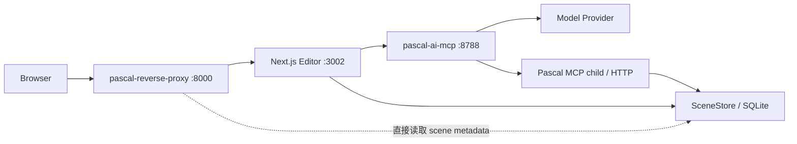
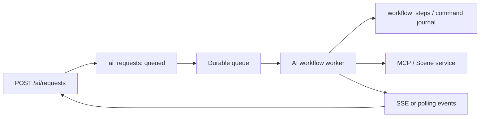
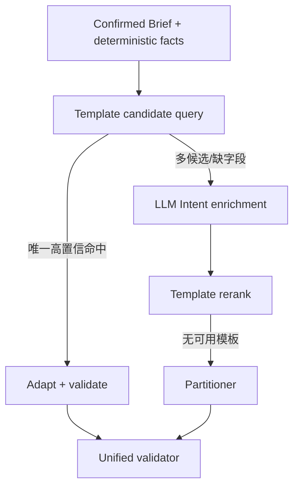
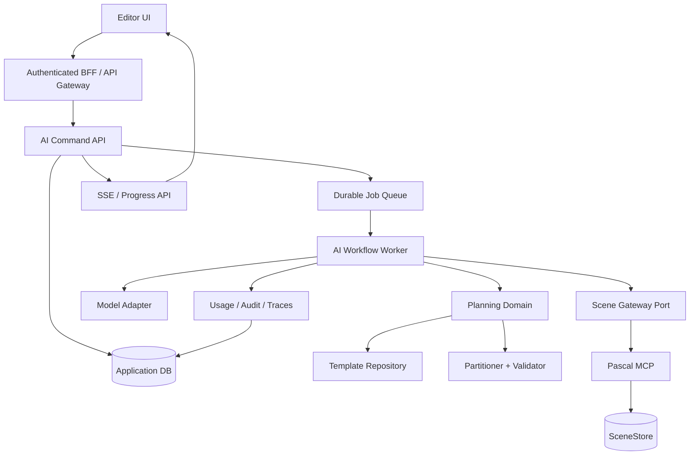

# Pascal Editor 与户型 AI 架构评估

状态：现状评估与演进建议（已经第二轮代码复核）  
评估日期：2026-07-17  
复核日期：2026-07-17 — 第 12 节证据索引已逐条对照代码验证，全部成立；复核补充与细化见第 14 节。  
执行清单：本文档已拆分为可逐项执行的任务清单，见 `ARCHITECTURE_TASKS.md`；进度以该文件为准。  
范围：Pascal Editor、`pascal-ai-mcp`、浏览器入口反向代理，以及三者之间的运行、数据和调用边界。本文不提出直接修改 MCP 内部实现的任务。

## 1. 结论摘要

项目的基础方向是正确的，尤其是两部分：

1. Editor 已经形成 `core / viewer / editor / app` 的分层意识，并正在通过 node registry 把节点几何、渲染、系统和工具能力从手写分派迁移到声明式注册；
2. 户型 AI 已从“让模型直接画几何和自由调用工具”演进为“结构化需求 → 确定性策略 → LayoutIntent → 模板或分区器 → 校验 → 确定性执行器 → completion gates”，这比纯 Agent 自由执行稳定得多。

当前主要风险不在某个户型算法是否够聪明，而在系统已接近产品化规模，但运行架构仍然是单机原型形态：

- AI 会话、长任务、并发锁、模型额度和执行状态都依赖一个 Bun 进程；
- 会话以整文件 JSON 异步覆盖保存，无法支持多实例、可靠审计和生产级并发；
- 一次生成仍是一条持续数分钟的 HTTP 请求，失败恢复依靠前端再次读取 session；
- 模型层只记录调用次数，没有保留 Token、实际模型、供应商请求 ID、时延和费用；
- 房间类型等关键业务语义保存在 AI session，而不是场景本身；
- 模板虽然叫“seed”，但必须先经过一次模型生成 Intent 才会匹配，并不是真正的模板优先；
- 反向代理同时承担代理、首页、鉴权、项目列表、封面文件和独立数据库职责，并直接读取 Pascal 的 SQLite；
- 代码中实际依赖关系与仓库宣称的 `core` 纯逻辑边界不完全一致，而且 CI 没有自动执行架构边界检查和 AI 测试。

因此，项目现阶段更接近“功能能力较完整的单进程高级原型”，尚不是可水平扩展、可计费、可审计、可安全对外开放的生产架构。

最应优先处理的不是继续增加模板数量，而是：

1. 建立请求、工作流和场景操作的持久化与幂等边界；
2. 建立模型调用级别的 Token、费用和全链路追踪；
3. 把房间类型等语义放回场景领域数据；
4. 将 `agent.ts` 拆为应用编排、领域规划和基础设施适配三层；
5. 让模板在模型生成 Intent 之前就参与候选选择；
6. 明确代理、Editor、AI 和场景存储的所有权边界。

## 2. 当前运行拓扑

当前本地运行由三个主进程和一个 AI 子进程组成：



Editor 的 AI 面板通过 Next.js 同源代理访问 AI 服务。AI 服务默认启动一个 stdio MCP 子进程，再通过 MCP 修改 SceneStore。反向代理对外提供首页和 Editor 路由，但还直接读取 Pascal SQLite 生成项目列表，并使用自己的 SQLite 保存项目封面和展示信息。

这个拓扑适合本地开发，但有三个结构性问题：

- 同一份场景数据存在 Editor API、MCP 和反向代理直读数据库三种访问方式；
- AI 长任务和会话状态没有独立的任务存储；
- 反向代理、Editor 和 AI 的身份信息没有贯通。

## 3. 当前做得比较好的部分

### 3.1 户型生成采用计划优先和确定性执行

`plan-builder.ts` 明确把模型限制在语义 Intent 层，坐标由模板或分区器产生，并统一经过 validator。场景施工再由 `scene-executor.ts` 确定性执行。这降低了模型直接修改几何造成的不可重复性。

当前管线的合理部分包括：

- Brief 经用户确认后才允许施工；
- `deriveStrategy` 是纯规则层，不额外消耗模型调用；
- 模板和分区器共用 `LayoutPlan` 与 `validateLayoutPlan`；
- 结构、门窗、家具和验收有分阶段 trace；
- 有超时、取消、模型调用次数上限、修复轮数上限；
- 完成状态由 completion gates 决定，不再只相信模型说“已完成”；
- modify 路径优先把请求翻译成结构化操作，再确定性执行。

这些原则应保留，后续重构不应退回“模型自由调用所有写工具”的形态。

### 3.2 规范、策略和模板已经有独立概念

`NormProfile`、`StrategyDecision`、`LayoutIntent`、`LayoutPlan`、模板库和验证器已经分成不同概念，说明领域模型正在形成。日本户型编号、DK/LDK、服务间和面积档位不再全部堆在 Prompt 中，这是正确方向。

### 3.3 Editor 的 registry-driven 方向值得继续

节点通过 definition 注册 schema、geometry、renderer、system、floorplan 和 capabilities，比在 Viewer 或 Editor 中不断扩展 `switch(node.type)` 更利于插件化和长期维护。

## 4. 问题分级

以下 P0 表示对外生产前必须解决；P1 表示应进入近期架构迭代；P2 表示中期治理和质量提升。

## 5. P0：对外生产前必须解决

### 5.1 缺少完整的身份、授权和数据隔离边界

现状：

- AI 服务默认监听 `0.0.0.0`；
- CORS 为 `*`；
- `/chat`、`/sessions/:id` 和 `/tools` 没有服务端身份校验；
- session 只由浏览器生成的 UUID 标识，没有 `userId / organizationId / project permission`；
- 反向代理的 API Key 保护默认关闭，文档也明确当前方案只适合本地测试；
- Next.js AI 代理没有把用户身份或授权上下文传给 AI 服务。

影响：

- 如果 8788 端口或反向代理被暴露，知道或猜到 session/scene 标识的调用方可能读取、删除会话或发起场景操作；
- 无法按用户、组织或项目实施额度、数据隔离、审计和删除；
- 无法回答“是谁让 AI 修改了这个场景”。

建议：

1. 浏览器只访问统一 BFF，不直接访问 AI 服务；AI 服务绑定内网地址；
2. BFF 验证真实登录 session，并向 AI 传递签名后的主体、组织、项目、场景权限和 trace ID；
3. AI 服务仍需执行服务间鉴权，不能完全信任来源 IP；
4. session、request 和 scene 操作都绑定主体；读取和删除 session 必须校验所有权；
5. 在此之前，把当前部署明确标记为 local/private network only。

证据：`src/server.ts` 的监听和 CORS、`appsettings.json` 的默认鉴权配置，以及 Editor AI 代理只转发 Content-Type。

### 5.2 长任务缺少持久化工作流、幂等和事务边界

现状：

- 生成和修改在一次 `/chat` HTTP 请求内同步完成；
- 单次请求可持续数分钟，服务端直接关闭该请求的 idle timeout；
- Next.js 代理会缓存完整上游响应，前端收到空响应后再读取 session 猜测任务是否成功；
- 请求没有 `requestId` 或 `idempotencyKey`；
- session lock、cancel flag 和 AbortController 都只存在于进程内；
- LangGraph 每回合只执行一个节点后结束，没有 checkpointer；
- 一个完整施工由多次 MCP 写操作组成，不是一个原子事务。中途失败时可能留下半建场景或已删除、未重建完的实时状态；
- fresh build 失败后会留下 abandoned scene，依靠 session 中的 ID 供人工清理。

影响：

- 浏览器、代理或进程重启时，客户端无法可靠区分“失败、仍在执行、已成功但响应丢失”；
- 客户端重试可能导致重复模型费用或重复场景操作；
- 无法水平扩展，因为同 session 的两次请求可能落到不同实例；
- 进程崩溃后只能把 phase 改成失败/可重试，不能从已完成的可靠步骤继续；
- 部分构建和结构重建的回滚语义不完整。

建议采用持久化命令/任务模型：



最低要求：

- 创建请求立即返回 `202 + requestId`；
- 每步有稳定 operation key，写操作可幂等重放；
- 工作流状态持久化，不依赖进程内 Map；
- 同一 scene 使用数据库锁、租约或版本 compare-and-swap；
- 每个阶段记录开始、成功、失败、取消和补偿结果；
- 场景写入使用 checkpoint/版本作为回滚边界；
- UI 用 SSE/WebSocket/轮询展示进度，不保持数分钟 HTTP 连接。

LangGraph 可以继续使用，但必须二选一：要么把它真正作为可持久化工作流的一部分；要么移除目前仅作为路由包装器的使用，由清晰的 application service 负责状态机。当前形态同时承担了依赖复杂度，却没有得到 durable workflow 的收益。

复核补充：代码对这两处现状是有意为之且留有注释——`agent.ts` 中 graph 定义处明确写着不加 checkpointer 是因为“每回合只执行一个 super-step、状态整体从 session 加载”；Next.js 代理缓存完整响应也是为规避长请求下流式转发被截断的已知问题。也就是说这两处不是疏忽，而是围绕“单次长 HTTP 请求”这一根因做的局部补丁。这反过来印证了本节结论：根因不消除，这类补丁会继续累积。

## 6. P1：近期应解决

### 6.1 SessionStore 不适合作为生产数据库

现状：

- 所有 session 一次性读入内存；
- 每次 set/delete 都序列化整个数据库并排队覆盖同一个 JSON 文件；
- 写入不要求调用者等待，失败只打印日志，业务请求仍可能返回成功；
- 进程退出没有等待 write queue flush；
- 校验只检查对象是否存在 `phase` 字段；
- 没有 schema version、迁移、索引、事务、过期清理和多实例协调。

复核补充：写入实现使用了 `tmp 文件 + rename` 的原子替换，因此单次写入不会产生半截文件，文件损坏风险低；真正的风险是**丢最新状态**（写失败仅打日志、退出不等待 flush）和**多实例互相覆盖**，本节结论不变。

影响：

- session 数量和消息长度增长后，内存、序列化和磁盘写放大明显；
- 突然退出可能丢失最后状态；
- 两个 AI 实例会互相覆盖文件；
- 无法高效查询用户、项目、失败阶段、用量和留存数据；
- session 内同时混放聊天内容、规划快照、执行 trace 和业务状态，删除与审计难以分离。

建议先使用与现有部署匹配的 SQLite/PostgreSQL，而不是继续增强 JSON 文件。至少拆分：

- `ai_sessions`：会话当前状态和版本；
- `ai_messages`：用户可见消息；
- `ai_requests`：每次发送/确认/修改；
- `workflow_steps`：生成和修改步骤；
- `ai_model_calls`：模型调用用量；
- `ai_tool_calls`：工具调用摘要；
- `ai_scene_changes`：场景版本和变更审计；
- `ai_validation_results`：验收结果。

大型 Prompt、图片 Base64、场景快照和工具完整返回不应直接塞进 session 行；图片和大型产物放对象存储或文件存储，数据库只保存引用。

### 6.2 模型调用没有 Token、成本和供应商级可观测性

现状：

- `ChatCompletionResponse` 类型只包含 `choices`，没有 `usage`、响应 ID、实际 model 和创建时间；
- `complete()` 和 `json()` 很快把完整响应降级为字符串/JSON；
- hook 只有 `onAttempt()`，只能累计真实 HTTP 尝试次数；
- session 只保存 `modelCallsTotal` 和每阶段的逻辑调用数；
- 没有每次调用的 operation、provider request ID、输入/输出 Token、缓存 Token、延迟、finish reason、错误状态和价格版本。

当前的“限流”实质是模型 HTTP 尝试次数上限，不是用户级请求、并发、Token 或费用额度。

影响：

- 无法核对供应商账单；
- 无法知道哪个阶段最贵、哪个模板或修复循环消耗异常；
- 无法做真实套餐额度、成本预警和模型路由评估；
- fallback 和 retry 虽然会计次数，但无法区分每次使用了哪个模型和多少 Token。

建议把模型客户端改为统一的调用结果：

```ts
type ModelCallResult<T> = {
  output: T
  provider: string
  model: string
  providerRequestId?: string
  usage: {
    inputTokens?: number
    outputTokens?: number
    reasoningTokens?: number
    cacheReadTokens?: number
    cacheWriteTokens?: number
  }
  finishReason?: string
  latencyMs: number
}
```

在模型适配器这一层按每次真实 HTTP attempt 写 `ai_model_calls`；业务层不自行估算 Token。此前的 `AI_USAGE_AUDIT_DESIGN.md` 已给出更完整的数据表和留存策略，可以作为实施规格。

### 6.3 房间语义的数据所有权放错了位置

现状：

- `LayoutPlan` 有稳定的 `RoomType`；
- 执行时调用 `create_room` 只传 `name` 和 `polygon`；
- AI 把 `zoneId → RoomType` 保存到自己的 WorkflowSession；
- 后续修改和校验优先用 session 映射，映射不存在时按中日英文房名正则猜类型；
- Zone 场景 schema 本身只有 name、polygon、color 和通用 metadata，没有正式的空间功能类型字段。

影响：

- 删除 AI session 后，同一场景失去权威房间类型；
- 从另一设备、另一 session 或非 AI 入口打开场景时只能按名字猜；
- 用户重命名房间可能改变校验、家具清单和连通性判断；
- 场景是业务实体，但它的关键语义被一个外部工作流 sidecar 持有，形成双重真相源。

建议：

- 把稳定空间语义纳入场景领域，例如 Zone 的正式 `spaceType/usageType` 或受版本管理的 metadata contract；
- 场景保存后，RoomType、来源 template/plan、plan room ID 等可追溯信息随场景存在；
- AI session 只缓存引用和当时计划，不再拥有场景当前语义；
- 名称正则只用于导入旧场景的迁移/推断，并明确置信度，不作为正常链路真相源。

这项改造需要先定义场景 schema 和兼容策略，但不等于必须让 AI 直接依赖 MCP 内部代码；可以通过正式的场景能力或工具契约承载。

### 6.4 `agent.ts` 是应用层 God Object

`agent.ts` 约 4,700 行，同时负责：

- session 生命周期和锁；
- 状态机路由；
- 需求抽取和防护栏；
- 模型选择、fallback 和调用预算；
- 生成、修改和问答三条工作流；
- MCP 调用；
- 场景快照、保护、清理、重建、修复和保存；
- 家具逻辑接线；
- 诊断、completion gates 和多语言回复；
- 大量房名、面积、动线和场景辅助算法。

影响：

- 任意新功能都容易修改同一个文件，冲突和回归面持续扩大；
- 领域逻辑和基础设施错误处理互相缠绕；
- 很难单独测试“工作流恢复”“模型计量”“场景事务”这些能力；
- LangGraph 节点只是该对象的私有方法，无法形成可替换边界。

建议按依赖方向拆分，而不是按文件长度机械拆分：

```text
src/
  domain/
    brief/
    planning/
    templates/
    validation/
    modification/
  application/
    generate-workflow.ts
    modify-workflow.ts
    inspect-workflow.ts
    session-service.ts
  ports/
    model-client.ts
    scene-gateway.ts
    workflow-store.ts
    telemetry.ts
  adapters/
    model/openai-compatible.ts
    scene/mcp-scene-gateway.ts
    persistence/sql-*.ts
  transport/http/
    routes.ts
```

依赖原则：domain 不依赖 HTTP、MCP、数据库或 LangGraph；application 只依赖 ports；adapters 实现 ports；transport 只处理协议和身份上下文。

### 6.5 当前模板不是严格意义上的 template-first

现状管线：

1. 确认 brief；
2. 调用模型生成 `LayoutIntent`；
3. `applyStrategy` 修正 Intent；
4. 才调用 `findTemplateSeed`；
5. 未命中再进入 partitioner。

因此 `findTemplateSeed` 自身虽然是零模型调用，但每次生成在它之前已经至少发生一次 Intent 模型调用。模板能否命中还依赖模型先输出可被归一化到同一 hub/房间结构的 Intent。

影响：

- 明明已有精确 2DK/2LDK 模板，也仍然产生额外延迟和费用；
- 模型输出微小漂移会让模板被拒绝；
- 模板数量增加不会线性提升命中率；
- 模板只是分区器的替代结果，没有反过来训练或约束分区器。

建议改成两阶段候选：



可直接从结构化 brief、`roomProgram`、面积、市场和显式厨房偏好构造模板查询；只有信息不足或多个候选需要消歧时才调用模型。

此外，当前模板只做整体等比缩放，并明确忽略单房间面积目标；显式地块尺寸也会直接禁用模板。中期应把模板表达提升为“拓扑图 + 比例约束 + 可伸缩区域”，让 solver 在保留模板动线的同时局部优化，而不是“整图缩放成功或完全回退”二选一。

### 6.6 模板数据缺少正式 schema、版本和迁移机制

现状：

- 模板 JSON 通过 `JSON.parse(...) as TemplateRecord` 读取；
- 运行时只粗略检查 `record.plan.rooms` 和 `record.meta` 是否存在；
- 没有 `schemaVersion`；
- meta 的 `typology`、`roomProgram` 仍是可选 string；
- 模板缓存为进程级 Map，修改文件后只有显式调用 invalidate 才能刷新；
- `check-templates.ts` 不是 package script，也没有接入 CI。

影响：

- 拼写错误、未知枚举、重复 ID、断开的连接等问题可能直到请求命中时才暴露；
- schema 演进后无法判断旧模板该如何迁移；
- 开发环境新增模板后可能需要重启才能生效；
- 数据质量依赖人工记得运行脚本。

建议：

- 用 Zod 定义并导出 `TemplateRecordSchema`；
- 增加 `schemaVersion` 和显式迁移函数；
- `market / quality / typology / roomProgram` 使用枚举；
- 启动时加载并输出结构化模板健康摘要；生产环境遇到非法 good 模板应 fail readiness，而不只是 trace；
- 增加 `templates:check` script，并在模板路径变化时由 CI 执行；
- 开发模式监听 templates 目录或提供管理端 reload，生产模式使用不可变构建产物。

### 6.7 反向代理越过了服务数据边界

反向代理当前同时承担：

- YARP 路由；
- 静态首页和资源服务；
- API Key 登录；
- Pascal 项目列表；
- 直接读取 Pascal SQLite；
- 项目名称/描述覆盖；
- 封面上传与文件管理；
- 自己的 proxy SQLite 初始化和 CRUD。

`Program.cs` 已超过 800 行。更关键的是，它直接依赖 Pascal `scenes` 表的列和数据库路径解析。SceneStore schema 一旦变化，代理可能在没有 API 契约变化的情况下损坏。

建议二选一：

1. 如果它只是 edge proxy：只保留路由、TLS、认证、限流和静态首页；项目列表与元数据全部通过 Editor/Scene API 获取；
2. 如果它是正式 BFF：把项目目录、封面、身份和 AI 请求入口定义为 BFF 模块，但仍通过稳定 API/port 访问场景服务，不直读另一个服务的数据库。

无论哪种方案，都应把 `Program.cs` 拆为 routes、auth、project catalog、cover storage、database 和 proxy configuration 模块。

## 7. P2：中期架构治理

### 7.1 仓库声明的 core 边界与实际实现不一致

`AGENTS.md` 明确规定 `packages/core` 是纯逻辑、不能依赖 Three.js、Viewer、Editor 或 floorplan 表示；但当前：

- `core` package 将 React Three Fiber 和 Three.js 列为 peer dependencies；
- `events/bus.ts` 暴露 `ThreeEvent` 和 `Object3D`；
- `scene-registry` 持有 Three.js 对象并使用 React hook；
- `registry/types.ts` 包含 `Object3D`、`BufferGeometry`、React component、floorplan palette 和 presentation contract；
- `ElevatorRuntimeSystem` 位于 core，却直接使用 `useFrame`；
- `systems.md` 自身一方面说 core 是纯逻辑，一方面示例又让 core system 导入 `useFrame`。

这说明实际架构已演进，但规则、包职责和代码没有一起收敛。

影响：

- `@pascal-app/core` 不能真正用于无 React/Three 的服务端或纯逻辑环境；
- 新贡献者无法判断“registry render contract 属于 core 还是 viewer”；
- 架构 review 依赖人工解释，规则无法自动执行；
- 文档互相矛盾会持续产生边界漂移。

建议先做架构决策，而不是逐个移动文件：

- 方案 A：坚持纯 core。把 `sceneRegistry`、R3F event、geometry/renderer contracts 和 runtime components 移到 viewer/platform package；core 只保留 node schema、关系、纯几何数据和 command；
- 方案 B：承认 core 是 Pascal runtime kernel，允许 React/Three contracts；另建真正纯净的 `@pascal-app/domain` 或 `@pascal-app/scene-model`。

从开源包复用和 AI/服务端共享领域模型的角度，推荐方案 A 或“新增 scene-model，再逐步瘦身 core”。无论选择哪种，都要同步 AGENTS、wiki 和 package dependency tests。

### 7.2 领域规则的所有权仍有反向依赖

例如 `areaBoundFor` 定义在 `plan-validator.ts`，但 `strategy.ts` 和 `modify-ops.ts` 都反向导入它。面积档位是领域政策，不应由 validator 模块拥有。

建议把以下规则放入明确的 domain policy：

- 房型分类和语义；
- 面积档位选择；
- 窗、动线、最小门边；
- 房间计数和必需空间；
- service room / DK / LDK 等市场规则。

Validator、strategy、modify 和 template matcher 都依赖这套 policy。这样能避免“为了共享规则而让策略层依赖校验器”的依赖倒置。

当前已经把 `classifyRoomTypeByName`、`kitchenIsCirculation` 等部分规则集中，说明方向正确；应继续完成收口，而不是再复制正则。

### 7.3 防护栏位于模型调用之后，不能承担成本防护

新场景输入会先调用完整 requirement extraction，再读取模型返回的 `relevant:false`。因此“今天天气怎么样”会被拦截，但仍然已经消耗了一次模型调用。

现有防护栏可以保护 brief 不被污染，却不能防止滥用、节省主模型费用或在 Prompt 发送前执行数据策略。

建议分层：

1. HTTP 层：身份、大小、类型、频率、并发和附件安全；
2. 低成本 scope classifier：确定性规则优先，必要时使用 fast model；
3. 业务 extraction：只处理 in-scope 或 uncertain 请求；
4. tool policy：按 workflow phase 使用 allowlist，写工具必须经过授权和确认；
5. post-validation：验证场景结果。

被拦截请求仍要记录 guardrail event，但模型用量可以为 0。

### 7.4 CI 没有覆盖 AI 测试、模板体检和架构边界

当前主 CI 只执行 lint/format 和 typecheck；MCP CI 只测试 MCP 与 Editor scene API。`pascal-ai-mcp` 虽然已有大量单测和 eval case，但没有 CI job 自动运行 `bun test`，模板体检脚本也没有接入。

影响：

- AI 规划、模板匹配、修改和 completion gates 的回归可以在 PR 合并后才发现；
- 文档中声明的 architecture boundary 没有工具强制；
- 本地“测试全过”依赖开发者手工执行。

建议增加按路径触发的 AI CI：

```text
pascal-ai-mcp/** 变化：
  bun run --cwd pascal-ai-mcp check-types
  bun test --cwd pascal-ai-mcp
  bun run --cwd pascal-ai-mcp templates:check --no-artifacts
  deterministic preview diff
```

再增加 dependency boundary check：

- core 禁止导入 Three/R3F/viewer/editor（如果最终选择纯 core）；
- viewer 禁止导入 editor/app；
- domain 禁止导入 transport/adapters；
- 模板 schema 与引用完整性检查。

线上 eval 涉及真实模型费用，不必每个 PR 全跑；可以使用 stubbed deterministic eval 作为 PR gate，真实供应商回归按 nightly/manual 执行并保存基线。

### 7.5 运维生命周期和健康检查仍偏开发态

现状：

- 三个进程手工启动，没有统一 supervisor/compose；
- AI 只处理 SIGINT，没有 SIGTERM 和未完成 session write drain；
- AI 在 MCP connect 成功后才监听，但 `/health` 没有主动检查 MCP、SessionStore 可写性、模板健康或模型供应商状态；
- MCP 连接断开后没有明确的重连/熔断状态；
- 没有进程级并发上限、队列深度、backpressure 和 readiness；
- 反向代理的 health 只返回目标地址，没有验证 Editor/AI 的依赖健康。

建议区分：

- liveness：进程事件循环可响应；
- readiness：数据库可读写、模板加载有效、MCP 可调用、必要配置完整；
- dependency health：模型供应商状态仅作为 degraded 信息，不应让整个服务永久不 ready；
- graceful shutdown：停止接新任务、等待或转移任务 lease、flush telemetry/session、关闭 MCP。

本地可以提供一个统一 `dev:stack` 或 compose 配置，但不要让生产可靠性依赖开发脚本。

## 8. 推荐的目标架构

不建议立刻拆成大量网络微服务。当前团队和代码规模更适合“模块化单体 + 独立 worker”，先建立清晰边界，再决定哪些模块需要单独部署。



### 8.1 数据所有权

| 数据 | 建议真相源 | 说明 |
|---|---|---|
| Scene graph、scene version | SceneStore | AI 和代理只能通过稳定接口访问 |
| 房间类型、空间用途 | Scene graph | 不能只存在 AI session |
| LayoutIntent / LayoutPlan | AI application DB，同时在 scene 留来源引用 | 用于重建、修改和审计 |
| AI session/current phase | AI application DB | 带 version，支持并发更新 |
| 用户可见消息 | AI application DB | 加密、可删除、有限留存 |
| 每次模型调用和 Token | AI application DB | 模型适配器是真相源 |
| 工具调用与场景版本变化 | Audit tables | 记录摘要和引用，不默认存大型响应 |
| 模板定义 | 版本化模板 repository | Zod 校验、不可变版本、可追溯 |
| 图片/DXF/大响应 | 对象或文件存储 | DB 保存引用、hash、大小和留存级别 |
| 项目封面和展示元数据 | Project catalog/BFF | 不直接侵入 SceneStore 表 |

### 8.2 一次生成请求的理想时序

1. BFF 完成身份与 scene 权限校验，生成 `traceId` 和 `idempotencyKey`；
2. AI API 创建 `ai_request`，返回 `202 requestId`；
3. worker 获取任务 lease，读取已确认 brief；
4. 先执行确定性 program/market/area 提取和模板候选；
5. 只有必要时调用模型补齐 Intent，并逐次记录真实 usage；
6. 模板/partitioner 产生 plan，validator 必须通过；
7. 写入 workflow checkpoint 和计划快照；
8. scene gateway 在明确版本上执行幂等 command batch；
9. 每阶段记录 scene version、tool summary 和 validation；
10. 成功发布 completed event；失败执行补偿或保留可恢复 checkpoint；
11. UI 通过 SSE/轮询更新进度和最终场景链接。

## 9. 分阶段落地建议

### Phase 1：可观测与数据基础（优先，约 1–2 个迭代）

- 建立 `ai_requests / ai_sessions / ai_messages / ai_model_calls`；
- 从模型响应保留 usage、request ID、model、finish reason 和 latency；
- 全链路引入 `traceId / requestId`；
- 将现有 session JSON 视为迁移源，停止作为生产真相源；
- 为模板增加 Zod schema、version 和 CI 体检；
- 把 AI 单测加入 CI。

完成标准：能回答某个用户请求调用了几次哪些模型、每次多少 Token、耗时多少、在哪一步失败。

### Phase 2：长任务可靠性（约 2–3 个迭代）

- `/chat` 改为提交 request/job；
- 引入 durable queue、worker lease、workflow step 和幂等键；
- UI 改为 progress event；
- 建立 scene version/lock 策略和阶段 checkpoint；
- 完成 SIGTERM、drain、readiness 和失败恢复。

完成标准：AI 或代理重启后任务状态不丢失；重复提交同一 idempotency key 不会重复扣费或重复施工。

### Phase 3：领域数据和模块边界（约 2–4 个迭代）

- 房间语义进入 Scene schema；
- `agent.ts` 拆成 application/domain/ports/adapters；
- 面积与房型 policy 从 validator 中抽出；
- 决定并执行 core 纯逻辑边界方案；
- 反向代理不再直读 Pascal SQLite。

完成标准：删除 AI session 后，场景仍可准确识别房间类型并执行校验；domain 单测不需要模型、MCP、数据库或 React 环境。

### Phase 4：真正的模板优先与质量闭环

- brief 直接查询模板候选；
- 为模板引入可伸缩区域、拓扑约束和局部优化；
- 记录模板命中、拒绝原因、用户后续修改量和质量评分；
- 使用真实使用数据优化 scorer，而不是只增加模板数量；
- nightly 运行供应商 eval，按 program/面积/市场追踪成功率与成本。

完成标准：标准房型在高置信模板命中时不需要额外 Intent 模型调用；模板命中后的平均人工修改量可量化并持续下降。

## 10. 建议先做与暂时不做

### 建议马上做

1. AI tests 和模板检查进 CI；
2. 模型响应 usage 穿线并落库；
3. request/trace/idempotency ID；
4. 模板 Zod schema 与 schemaVersion；
5. 正式确定房间语义的场景字段；
6. 设计 durable job，再改前端长请求交互；
7. 把对外部署限制写清楚并关闭 AI 端口的公网暴露。

### 暂时不建议做

- 不要现在就拆成十几个网络微服务；
- 不要用更多 Prompt 掩盖数据所有权和事务问题；
- 不要继续把所有审计、Token、消息和计划塞进 WorkflowSession；
- 不要用 Redis 进程锁代替持久化工作流和幂等设计；
- 不要让反向代理继续扩展业务表并直接读取 SceneStore schema；
- 不要在没有 schema/version/CI 前继续无限增加模板。

## 11. 建议跟踪的架构指标

上线后至少跟踪：

- 请求成功率、取消率、恢复率；
- P50/P95 端到端时延和各阶段时延；
- 每请求模型调用数、输入/输出 Token、费用；
- template direct hit、template after enrichment、partitioner fallback 比例；
- plan validator 首轮通过率；
- scene execution 重试数和部分失败率；
- completion gates 一次通过率；
- abandoned scene 数；
- 幂等去重次数；
- session/scene version conflict 数；
- 用户生成后 5 分钟内的手动结构修改量；
- 按 roomProgram、面积段和 market 的质量分布。

## 12. 主要代码证据索引（已逐条复核，✓ = 与代码一致）

- ✓ AI HTTP 长请求、开放 CORS、无身份路由：`src/server.ts`（`/chat` 处 `bunServer.timeout(request, 0)`；`corsHeaders()` 返回 `Access-Control-Allow-Origin: *`；`/chat`、`/sessions/:id`、`/tools` 均无鉴权；默认 host 见 `src/config.ts` 的 `AI_MCP_HOST || '0.0.0.0'`；仅处理 SIGINT）
- ✓ Editor AI 同源代理缓存完整响应：`apps/editor/app/api/ai/[...path]/route.ts`（`await response.text()` 全量缓冲，注释说明是为规避长请求截断）
- ✓ 前端对空响应通过 session 恢复：`apps/editor/components/ai-assistant-bubble.tsx`
- ✓ 进程内锁、取消和调用预算：`src/agent.ts`（约 4,700 行）
- ✓ LangGraph 单节点回合、无 checkpointer：`src/agent.ts#createWorkflowGraph`（5 个 node 均直接 `addEdge(x, END)`，注释明确不加 checkpointer 是有意选择）
- ✓ JSON 整库 session 存储：`src/session-store.ts`（80 行；整库序列化 + 异步 write queue + tmp/rename 原子替换；`flush` 失败仅 `console.error`；校验仅 `'phase' in value`）
- ✓ 模型响应丢弃 usage：`src/types.ts#ChatCompletionResponse`（仅 `choices`，无 `usage`/`id`/`model`）、`src/openai-compatible.ts`（hook 仅 `onAttempt`）
- ✓ 模板在模型 Intent 之后匹配：`src/plan-builder.ts`（`evaluateIntentReply` → `applyStrategy` → `findTemplateSeed`，模板匹配在模型回复解析之后）
- ✓ 模板弱解析和进程缓存：`src/template-seed.ts`（`JSON.parse(...) as TemplateRecord`；模块级 `templateCache` Map；等比缩放仅允许约 ±10%；strategy 带 `footprintHint` 时直接跳过模板）
- ✓ RoomType 保存在 session：`src/types.ts#WorkflowSession.zoneRoomTypes`
- ✓ 场景施工只传 room name/polygon：`src/scene-executor.ts`（`call('create_room', { levelId, name, polygon })`）
- ✓ Zone schema 无正式空间用途：`packages/core/src/schema/nodes/zone.ts`（仅 name/polygon/color/通用 metadata）
- ✓ 反向代理直读 Pascal SQLite 并维护自己的业务数据库：`pascal-reverse-proxy/Program.cs`（825 行；`/proxy/scenes` 直接 `SELECT ... FROM scenes`；`data/proxy.db` 自有库；`appsettings.json` 中 `ProxyAuth.Enabled: false`）
- ✓ core 边界定义：`AGENTS.md`、`wiki/architecture/systems.md`
- ✓ core 的 Three/R3F 实际依赖：`packages/core/package.json`（peerDependencies 含 `three`、`@react-three/fiber`、`@react-three/drei`、`react`）、`packages/core/src/events/bus.ts`（导入 `ThreeEvent`、`Object3D`）、`packages/core/src/hooks/scene-registry/scene-registry.ts`、`packages/core/src/systems/elevator/elevator-runtime-system.tsx`（直接 `useFrame`）
- ✓ CI 未运行 AI tests：`.github/workflows/ci.yml`、`.github/workflows/mcp-ci.yml`（后者仅 `bun test --cwd packages/mcp` 与 Editor scene API 测试；`pascal-ai-mcp` 的 `bun test` 未接入）
- ✓ 模板体检脚本未接入：`pascal-ai-mcp/scripts/check-templates.ts` 存在，但 `pascal-ai-mcp/package.json` scripts 中无对应条目
- ✓ 防护栏在模型调用之后：`src/agent.ts`（requirement extraction 返回后才检查 `extracted.relevant === false`）
- ✓ 面积档位反向依赖：`src/plan-validator.ts#areaBoundFor` 被 `src/strategy.ts` 和 `src/modify-ops.ts` 导入
- ✓ AI 使用计量详细设计：`pascal-ai-mcp/docs/AI_USAGE_AUDIT_DESIGN.md`

## 13. 最终建议

如果只能选择一条主线，建议把下一阶段定义为“AI 生成可靠性与数据基础”，而不是“继续扩模板”。

优先顺序应为：

```text
模型用量与 request trace
  → 数据库 session/request/workflow
  → durable job + 幂等 + scene version
  → 房间语义进入场景
  → agent 模块化
  → 真正 template-first
  → 模板拓扑优化与质量学习
```

完成前三步后，系统才具备可靠评估“模板是否真的更好”“哪种分区策略成本最低”“一次修复为什么失败”的数据基础；否则继续增加规则和模板，会让功能越来越多，但故障定位、成本控制和架构演进越来越困难。

## 14. 复核记录（2026-07-17）

第二轮复核对第 12 节全部证据逐条对照代码，未发现与代码不符的论断。以下为复核中的细化与补充，不改变原结论：

1. **两处“缺陷”实为有注释的权宜之计**（详见 5.2 复核补充）：LangGraph 不加 checkpointer 和 Next.js 代理全量缓冲响应，代码注释都解释了原因。它们是围绕“单次长 HTTP 请求”根因的局部补丁，印证而非削弱 P0 5.2 的结论——改造时应连同这些补丁一起移除，避免遗留。
2. **SessionStore 的风险定性更准确的说法是“丢最新状态 + 多实例覆盖”，而非文件损坏**：写入已用 tmp+rename 原子替换（详见 6.1 复核补充）。迁移到数据库的建议不变。
3. **`/chat` 无请求体大小限制**：`imageDataUrl` 以 Base64 内联在 JSON body 中，服务端不限制大小、不校验类型。这属于 7.3 建议的“HTTP 层：大小、类型”防护缺失的具体实例，且大图会整体进入 session（对应 6.1 的写放大问题）。
4. **`/health` 会向未鉴权调用方暴露 provider、model、mcpMode 等配置信息**：单独看是小问题，但在 5.1 修复（绑定内网 + 服务间鉴权）之前，这也是不应公网暴露 8788 端口的又一理由。
5. **模板缩放约束比正文描述更严格**：等比缩放只允许面积比约 ±10%（线性尺度），超出即回退分区器。这使 6.5 的“模板数量增加不会线性提升命中率”问题更突出——命中窗口本身就窄。
6. **优先级判断复核意见**：同意“模型用量与 request trace”先行。补充一点顺序建议——第 10 节“马上做”清单中第 1 项（AI tests 进 CI）与其余项无依赖关系且成本最低（`bun test` 脚本已存在，只缺 workflow job），可以在任何架构讨论结束前先落地。
